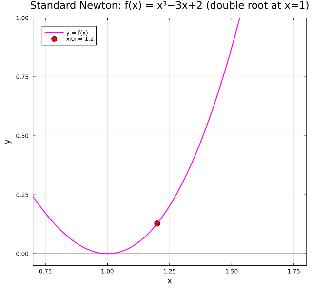
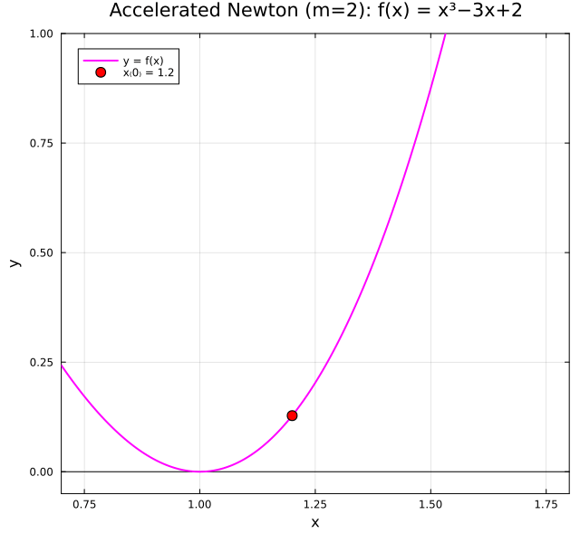

← [Numerical Methods](../)

Source inspiration: [@mathewsSite].

## Description

Standard Newton-Raphson converges **quadratically** at simple roots but degrades to **linear** convergence at multiple roots, because $f'(x^*) = 0$ there. Two methods restore quadratic convergence.

**Accelerated Newton-Raphson (Method A)** multiplies the Newton step by the known root multiplicity $m$:
$$x_{n+1} = x_n - m \cdot \frac{f(x_n)}{f'(x_n)}$$
This compensates for the vanishing derivative and recovers the quadratic rate. It requires knowing $m$ in advance.

**Modified Newton-Raphson (Method B)** avoids needing $m$ by reformulating the problem. If $f$ has a root of multiplicity $m$ at $x^*$, then $h(x) = f(x)/f'(x)$ has a **simple** root at $x^*$. Applying Newton's method to $h$ gives:
$$x_{n+1} = x_n - \frac{f(x_n)\,f'(x_n)}{f'(x_n)^2 - f(x_n)\,f''(x_n)}$$
This also converges quadratically, without knowing $m$.

Both methods require that $f$ be sufficiently smooth near the root and that the starting point $x_0$ be close enough to $x^*$.

## Animations

Each animation below shows the **Newton tangent-line diagram** for three methods applied to the same double root. At each iterate $x_n$, the line from $(x_n,\, f(x_n))$ to the x-axis intercept traces the next approximation $x_{n+1}$. Cases 1 and 2 both plot $f(x)$; Case 3 plots $h(x) = f(x)/f'(x)$, which has a *simple* root where $f$ has a double root.

Julia source scripts that generated these animations are linked under each case.

### Case 1 — Standard Newton-Raphson, linear convergence, $f(x) = x^3 - 3x + 2$, $x_0 = 1.2$

**Behavior:** $f(x) = (x-1)^2(x+2)$ has a double root at $x^* = 1$. Because $f'(x^*) = 0$ at a multiple root, the asymptotic error constant is $(m-1)/m = 1/2$, meaning each step only halves the error. The tangent line at $x_n$ is nearly horizontal near the root, so it crosses zero far from $x^*$ — forcing many iterations to creep toward $x = 1$.

[Julia source](accnewtonaa.jl)

### Case 2 — Accelerated Newton-Raphson (Method A, $m=2$), quadratic convergence, $f(x) = x^3 - 3x + 2$, $x_0 = 1.2$

**Behavior:** The accelerated formula $x_{n+1} = x_n - m \cdot \tfrac{f(x_n)}{f'(x_n)}$ with $m = 2$ enlarges each Newton step by the known multiplicity, compensating for the vanishing derivative at the double root. This restores quadratic convergence: $|e_{n+1}| \approx C |e_n|^2$. The same function and starting point as Case 1 now converges in just a few steps. **Requires knowing $m$ in advance.**

[Julia source](accnewtonbb.jl)

### Case 3 — Modified Newton-Raphson (Method B), quadratic convergence, $f(x) = x^3 - 3x + 2$, $x_0 = 1.2$

**Behavior:** Define $h(x) = f(x)/f'(x)$. At a double root of $f$, $h$ has a **simple** root — so standard Newton on $h$ gives quadratic convergence. The iteration formula
$$x_{n+1} = x_n - \frac{f(x_n)\,f'(x_n)}{f'(x_n)^2 - f(x_n)\,f''(x_n)}$$
implements Newton on $h(x)$ using $f$, $f'$, and $f''$ directly. The animation plots $h(x) = (x-1)(x+2)/(3(x+1))$ and shows the tangent lines converging to $x = 1$ in just 2 steps. **Does not require knowing $m$.**

[Julia source](accnewtoncc.jl)

