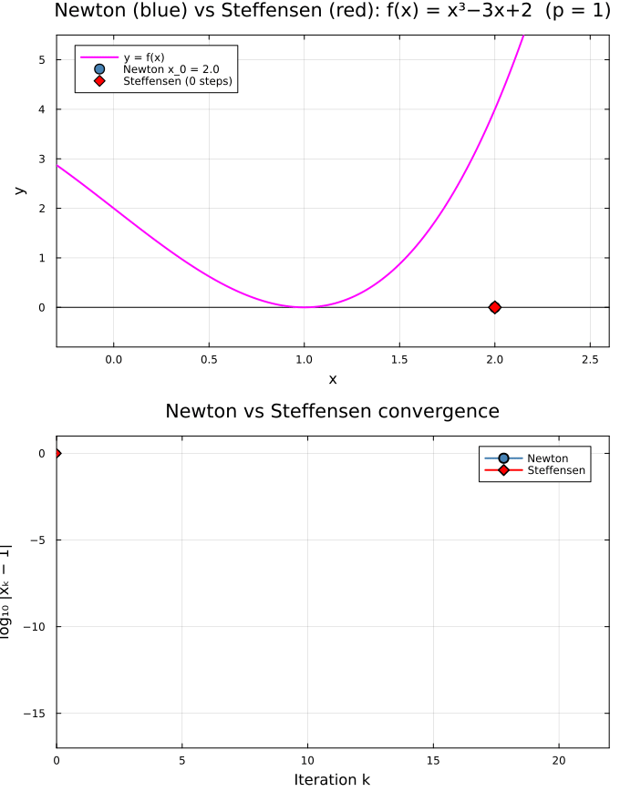
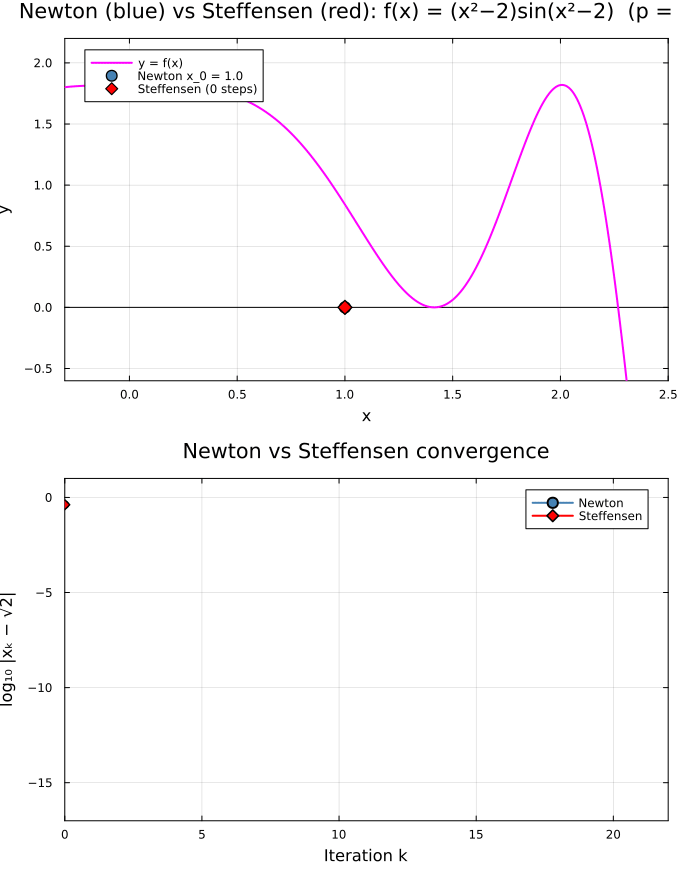
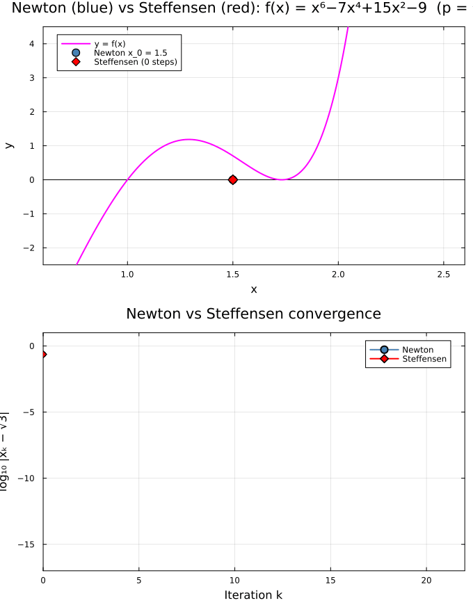

← [Numerical Methods](../)

Source inspiration: [@mathewsSite].

## Description

### The Problem: Linear Convergence at Multiple Roots

Newton–Raphson's method converges *quadratically* at simple roots — the number of correct decimal digits roughly doubles each iteration. However, at a **multiple root** of order $m \geq 2$, convergence degrades to *linear*: the error satisfies

$$
\lim_{k \to \infty} \frac{|x_{k+1} - p|}{|x_k - p|} = \frac{m - 1}{m}
$$

For a double root ($m = 2$) the ratio is $\tfrac{1}{2}$, meaning each Newton step only halves the error — hundreds of iterations may be needed to reach machine precision.

### Aitken's $\Delta^2$ Process

Given *any* linearly convergent sequence $\{x_k\}$ converging to a limit $p$ (not just Newton iterates), Aitken's process constructs an accelerated sequence $\{\hat{x}_k\}$ that converges *faster* than the original. Define the forward difference operator $\Delta x_k = x_{k+1} - x_k$ and the second difference $\Delta^2 x_k = x_{k+2} - 2x_{k+1} + x_k$. Then

$$
\hat{x}_k = x_k - \frac{(\Delta x_k)^2}{\Delta^2 x_k} = x_k - \frac{(x_{k+1} - x_k)^2}{x_{k+2} - 2x_{k+1} + x_k}
$$

**Theorem (Aitken Acceleration).** If $\{x_k\} \to p$ linearly with $x_k \neq p$ for all $k$, then

$$
\lim_{k \to \infty} \frac{\hat{x}_k - p}{x_k - p} = 0
$$

i.e. $\{\hat{x}_k\}$ converges to $p$ faster than $\{x_k\}$ in the sense that the ratio of errors goes to zero.

### Steffensen's Acceleration Method

Steffensen's method applies Aitken's $\Delta^2$ process *directly* to the Newton iteration to create a self-contained algorithm that achieves **superlinear convergence even at double roots**. Starting from $p_0$:

1. Compute two Newton steps: $\displaystyle q_1 = p_0 - \frac{f(p_0)}{f'(p_0)}$, $\quad q_2 = q_1 - \frac{f(q_1)}{f'(q_1)}$
2. Apply Aitken's formula: $\displaystyle p_1 = p_0 - \frac{(q_1 - p_0)^2}{q_2 - 2q_1 + p_0}$
3. Set $p_0 \leftarrow p_1$ and repeat.

Each outer iteration consumes **two Newton steps** but produces a correction that is far more accurate than either step alone. The combined effect restores roughly **quadratic convergence** at roots where unaided Newton would only converge linearly.

### Summary Comparison

| Method | Root type | Convergence order | Notes |
|---|---|---|---|
| Newton–Raphson | Simple ($m=1$) | Quadratic ($\approx 2$) | Standard |
| Newton–Raphson | Double ($m=2$) | Linear ($\tfrac{1}{2}$) | Very slow |
| Steffensen | Double ($m=2$) | Superlinear ($\approx 2$) | Two Newton evals per step |

## Animations

Each animation below shows **two synchronized panels** for a given function: the top panel traces Newton–Raphson's tangent-line geometry (one step per frame), and the bottom panel plots $\log_{10}|x_k - p|$ vs. iteration count for both Newton and Steffensen side by side. Because both panels share the same frame clock, you can directly compare where Newton is geometrically with how fast each method is converging numerically.

Julia source scripts that generated these animations are linked under each case.

### Case 1 — $f(x) = x^3 - 3x + 2$, double root $p = 1$, $x_0 = 2.0$

**Behavior:** Newton–Raphson converges linearly (slowly) to the double root $p = 1$ of $f(x) = (x-1)^2(x+2)$. At a double root the asymptotic error ratio is $\tfrac{1}{2}$, so each step only halves the error. Steffensen's $\Delta^2$ acceleration restores superlinear convergence, reaching machine precision in a handful of steps.

[Julia source](aitkenab.jl)

### Case 2 — $f(x) = (x^2-2)\sin(x^2-2)$, double root $p = \sqrt{2}$, $x_0 = 1.0$

**Behavior:** The double root $p = \sqrt{2}$ causes Newton to converge linearly. Steffensen's acceleration applied to the Newton iterates recovers rapid convergence, dropping to machine precision far sooner.

[Julia source](aitkencd.jl)

### Case 3 — $f(x) = x^6 - 7x^4 + 15x^2 - 9$, double root $p = \sqrt{3}$, $x_0 = 1.5$

**Behavior:** $f(x) = (x^2-1)(x^2-3)^2$ has a double root at $p = \sqrt{3} \approx 1.732$. Newton's linear crawl is visible in both the tangent-line panel and the gently sloping error curve; Steffensen converges in only a few Aitken-accelerated steps.

[Julia source](aitkenef.jl)

