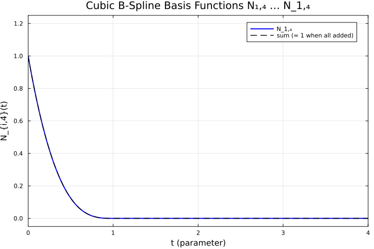

← [Numerical Methods](../)

Source inspiration: [@mathewsSite].

## Description

A B-spline curve of degree $p$ is expressed as a weighted sum of control points and basis functions:

$$
C(t)=\sum_i P_i\,N_{i,p}(t).
$$

The basis functions are defined recursively by the Cox-de Boor relation over a knot vector. Two key features make B-splines useful in geometric modeling: local support (moving one control point only affects a local region of the curve) and smoothness controlled by degree and knot multiplicity.

With a clamped knot vector, the curve interpolates the first and last control points while remaining inside the convex hull of the control polygon.

## Animations

These animations show two complementary views of cubic B-splines: the smooth curve traced from control points, and the individual basis functions $N_{i,4}(t)$ whose weighted sum defines the curve.

Julia source scripts that generated these animations are linked under each case.

### Case 1 — Cubic B-spline curve traced from 7 control points

**Behavior:** A cubic B-spline curve with a clamped knot vector passes through the first and last control points and is smoothly pulled toward the interior control points. The curve is $C^2$-continuous everywhere. The animation traces the curve parameter $t$ from start to end.

[Julia source](bsplineaa.jl)

### Case 2 — Basis functions $N_{1,4}, \ldots, N_{7,4}$ and the partition of unity

**Behavior:** Each cubic B-spline basis function $N_{i,4}(t)$ is non-negative and has local support over exactly 4 knot spans. Their sum equals 1 everywhere in the domain (partition of unity), which is why the B-spline curve lies within the convex hull of the control polygon.

[Julia source](bsplinebb.jl)

