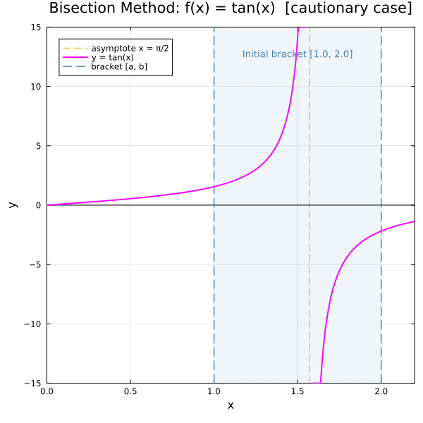

← [Numerical Methods](../)

Source inspiration:  [@mathewsSite].

## Animations

Each animation below shows the **bracket-halving diagram** for the bisection method.
The shaded region marks the current bracket $[a, b]$ that is known to contain a root (by the Intermediate Value Theorem).
Each frame computes the midpoint $c = \tfrac{a+b}{2}$, evaluates $f(c)$, and narrows the bracket to the half that still contains the sign change.

Julia source scripts that generated these animations are linked under each case.

### Case 1 — Convergent, $f(x) = x^3 + 4x^2 - 10$, $[a_0, b_0] = [1, 2]$

**Behavior:** $f(1) = -5 < 0$ and $f(2) = 14 > 0$, so the IVT guarantees a root in $[1, 2]$.
The true root is $x^* \approx 1.3688$. The bracket halves each step and the midpoints converge monotonically.

[Julia source](bisectionaa.jl)

### Case 2 — Spurious convergence (cautionary), $f(x) = \tan(x)$, $[a_0, b_0] = [1, 2]$

**Behavior:** $f(1) = \tan(1) > 0$ and $f(2) = \tan(2) < 0$, so there is a sign change on $[1, 2]$.
However, this sign change is caused by the vertical asymptote at $x = \tfrac{\pi}{2} \approx 1.5708$, not a true root.
Bisection converges to the asymptote — illustrating that the IVT guarantee requires $f$ to be continuous on $[a, b]$.

[Julia source](bisectionbb.jl)

