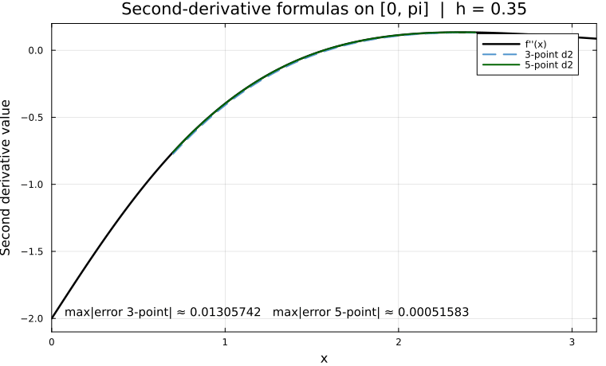

← [Numerical Methods](../)

Source inspiration: [@mathewsSite].

## Description

This topic focuses on how central finite-difference formulas are derived from Taylor expansions and solved in parallel as small linear systems. The legacy module emphasizes deriving first- and second-derivative formulas together rather than treating each formula as an isolated trick.

For symmetric stencils, odd and even Taylor terms cancel in predictable ways, producing compact formulas with clear error orders. The resulting three-point and five-point formulas explain why wider stencils can significantly improve accuracy for smooth functions.

## Animations

Each animation below visualizes one derived stencil formula using the legacy test function $f(x)=e^{-x}\sin(x)$.

### Case 1 - three-point first derivative, $f'(x_0) \approx \dfrac{f(x_0+h)-f(x_0-h)}{2h}$

**Behavior:** The symmetric three-point slope converges to the tangent slope as $h$ decreases, reflecting second-order accuracy.

[Julia source](diffformaa.jl)

### Case 2 - five-point first derivative, $f'(x_0) \approx \dfrac{f(x_0-2h)-8f(x_0-h)+8f(x_0+h)-f(x_0+2h)}{12h}$

**Behavior:** The five-point stencil uses cancellation of lower-order truncation terms, so its error drops faster than the three-point estimate for the same $h$.

[Julia source](diffformab.jl)

### Case 3 - second derivative formulas at $x_0=1$

**Behavior:** The curve profiles compare $f''(x)$ against the three-point and five-point second-derivative stencils over $[0,\pi]$. As $h$ decreases, both improve, and the five-point stencil stays noticeably closer because it cancels lower-order truncation terms.

[Julia source](diffformac.jl)

## Derivation Notes

From Taylor expansions about $x$,

$$
f(x\pm h)=f(x)\pm hf'(x)+\frac{h^2}{2}f''(x)\pm\frac{h^3}{6}f^{(3)}(x)+\cdots
$$

one obtains

$$
f'(x)=\frac{f(x+h)-f(x-h)}{2h}+O(h^2),
\quad
f''(x)=\frac{f(x+h)-2f(x)+f(x-h)}{h^2}+O(h^2).
$$

Including $x\pm2h$ adds degrees of freedom and yields five-point formulas with $O(h^4)$ truncation behavior for smooth $f$.
