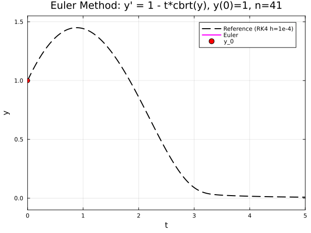
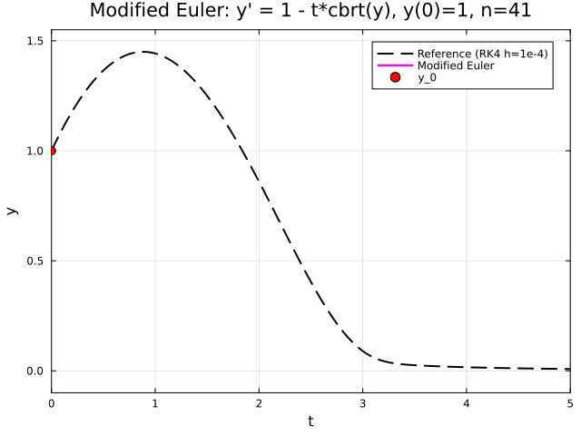

← [Numerical Methods](../)

Source inspiration: [@mathewsSite].

## Description

Euler's method is the simplest one-step numerical solver for an initial value problem
$y' = f(t,y)$, $y(t_0)=y_0$. It advances the solution by following the local tangent
at each grid point:

$$
y_{n+1} = y_n + h\,f(t_n,y_n), \qquad t_{n+1}=t_n+h.
$$

For smooth problems, Euler has local truncation error $O(h^2)$ and global error
$O(h)$, so reducing the step size improves accuracy linearly. The modified Euler
(Heun) predictor-corrector method averages endpoint slopes and improves global
accuracy to $O(h^2)$.

## Animations

Each animation below shows the **numerical solution trace** for the IVP
$y' = 1 - t\sqrt[3]{y}$, $y(0)=1$ on $0 \le t \le 5$, using the legacy module's
$n=41$ point setup ($h=0.125$). Each frame adds one new computed point and segment.
The dashed black curve is a high-accuracy reference trajectory computed with fixed-step
RK4 at $h=10^{-4}$ and shown for direct visual error comparison.

Legacy archive note: the original `Euleraa.gif` and `MEuleraa.gif` files were missing
from the recovered animation folders, so these are reconstructed from the module's
worked-example equations and parameters (Examples 11-12).

### Case 1 - Forward Euler, $y' = 1 - t\sqrt[3]{y}$, $y(0)=1$, $0 \le t \le 5$, $n=41$

**Behavior:** Forward Euler accumulates first-order global error and drifts low near
$t=5$ relative to the dashed RK4 reference trajectory.

[Julia source](eulersmethodaa.jl)

### Case 2 - Modified Euler (Heun), same IVP and grid

**Behavior:** The predictor-corrector slope average reduces drift and stays closer to
the dashed RK4 reference trajectory at the right endpoint.

[Julia source](eulersmethodbb.jl)

## Derivation Notes (Planned)

Short derivations will be added to explain the core equations and assumptions.

## Worked Example (Planned)

A compact numerical example with intermediate steps will be included.

## Implementation Notes (Planned)

Implementation details, numerical stability notes, and practical pitfalls will be added.

## Legacy Animation Inventory (Stub)

- Legacy module page: [Euler's Method for ODE's](http://localhost:8000/n2003/Euler'sMethodMod.html) (ok)
- Animation links found in module Animations paragraph: 8
- Unique animation portals: 2

### Animation Portals

1. [Euler's Method](http://localhost:8000/a2001/Animations/OrdinaryDE/Euler1/Euler.html) (ok)
2. [Modified Euler's Method](http://localhost:8000/a2001/Animations/OrdinaryDE/MEuler1/MEuler.html) (ok)

- Animation item links found: 2

### Animation Items

1. [Euler's Method](http://localhost:8000/a2001/Animations/OrdinaryDE/Euler1/Euleraa.html) (ok)
- Main animated GIF count: 1
- http://localhost:8000/a2001/Animations/OrdinaryDE/Euler1/Euleraa.gif
2. [Modified Euler's Method](http://localhost:8000/a2001/Animations/OrdinaryDE/MEuler1/MEuleraa.html) (ok)
- Main animated GIF count: 1
- http://localhost:8000/a2001/Animations/OrdinaryDE/MEuler1/MEuleraa.gif
