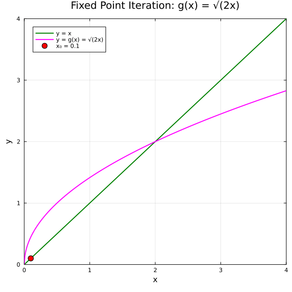
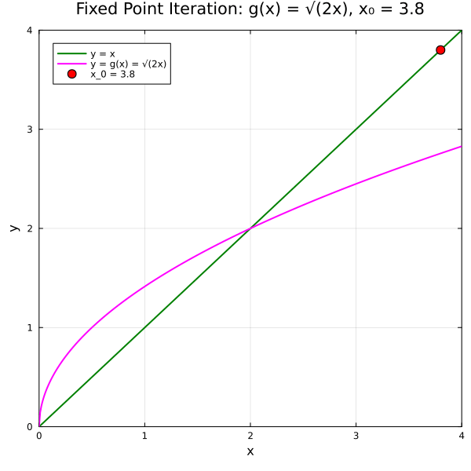
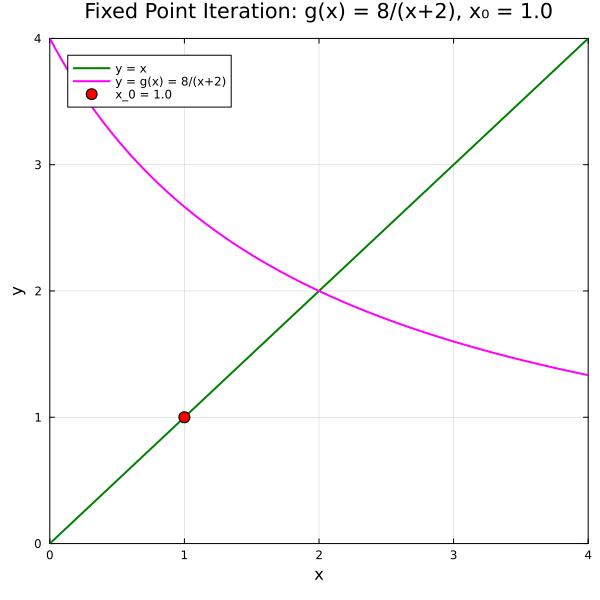
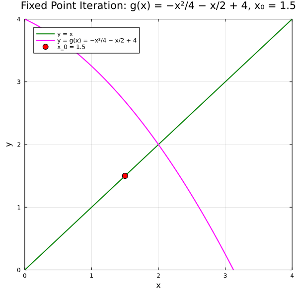

← [Numerical Methods](../)

Source inspiration:  [@mathewsSite].

## Animations

Each animation below shows the **cobweb (staircase) diagram** for fixed point iteration. The diagram
plots two curves — the identity line $y = x$ and the iteration function $y = g(x)$ — then traces
the staircase path: from the current iterate $x_n$ on the diagonal, vertical to the curve to get
$g(x_n) = x_{n+1}$, then horizontal back to the diagonal. Convergence occurs when $|g'(x^*)| < 1$.

Julia source scripts that generated these animations are linked under each case.

### Case 1 — Convergent staircase, $g(x) = \sqrt{2x}$, $x_0 = 0.1$

**Behavior:** The curve $g(x) = \sqrt{2x}$ intersects $y = x$ at $x^* = 2$.
Since $g'(2) = \tfrac{1}{2} < 1$, iteration converges from below in a monotone staircase.

[Julia source](fixpointaa.jl)

### Case 2 — Convergent staircase, $g(x) = \sqrt{2x}$, $x_0 = 3.8$

**Behavior:** Same function as Case 1 but starting above the fixed point.
The staircase descends monotonically to $x^* = 2$, confirming convergence from both sides.

[Julia source](fixpointbb.jl)

### Case 3 — Oscillating convergent, $g(x) = \tfrac{8}{x+2}$, $x_0 = 1.0$

**Behavior:** The curve $g(x) = \tfrac{8}{x+2}$ is strictly decreasing, so $g'(2) = -\tfrac{1}{2}$.
Since $|g'(2)| = \tfrac{1}{2} < 1$, iteration converges, but the staircase alternates sides of $x^*$ on each step.

[Julia source](fixpointcc.jl)

### Case 4 — Divergent, $g(x) = \tfrac{x^2}{4} + \tfrac{x}{2}$, $x_0 = 1.5$

**Behavior:** The curve $g(x) = \tfrac{x^2}{4} + \tfrac{x}{2}$ is tangent to $y = x$ at $x^* = 2$ from below.
Since $g'(2) = \tfrac{3}{2} > 1$, the staircase walks away from the fixed point toward the left.

[Julia source](fixpointdd.jl)

### Case 5 — Divergent, $g(x) = \tfrac{x^2}{4} + \tfrac{x}{2}$, $x_0 = 2.5$

**Behavior:** Same function as Case 4 but starting above the fixed point.
The staircase moves monotonically rightward and diverges, showing instability from both sides.

[Julia source](fixpointee.jl)

### Case 6 — Oscillating divergent, $g(x) = -\tfrac{x^2}{4} - \tfrac{x}{2} + 4$, $x_0 = 1.5$

**Behavior:** The curve $g(x) = -\tfrac{x^2}{4} - \tfrac{x}{2} + 4$ is steeply decreasing at $x^* = 2$.
Since $g'(2) = -\tfrac{3}{2}$ and $|g'(2)| = \tfrac{3}{2} > 1$, iteration diverges while oscillating — the staircase spirals outward from the fixed point.

[Julia source](fixpointff.jl)

