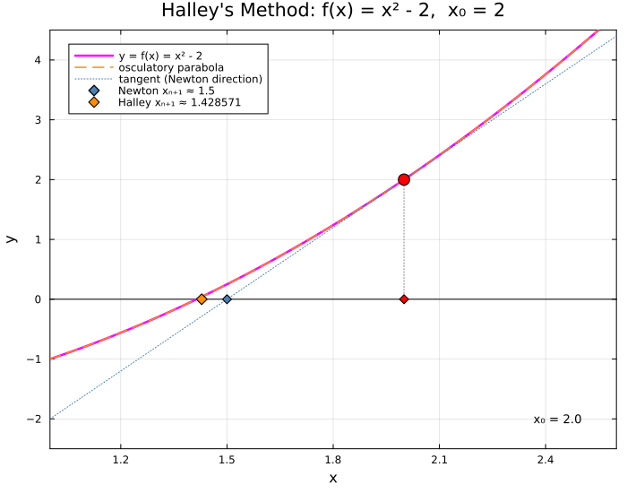
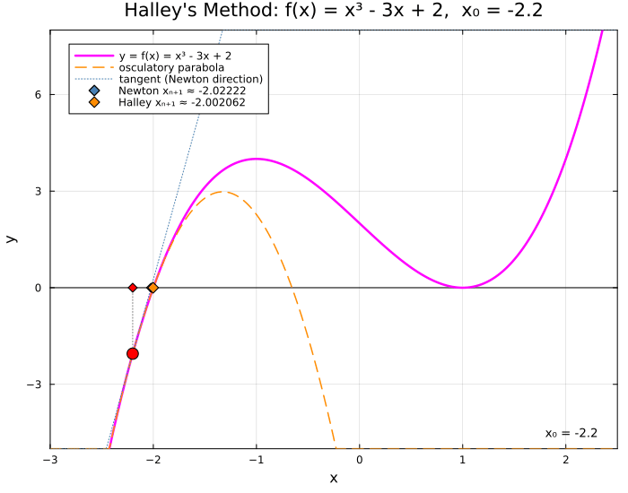

← [Numerical Methods](../)

Source inspiration:  [@mathewsSite].

## Description

**Halley's method**, attributed to Edmond Halley (1656–1742), is a root-finding algorithm that extends Newton-Raphson by incorporating the second derivative $f''$. Where Newton-Raphson fits a tangent line at each iterate and finds its $x$-intercept, Halley's method fits an osculating (second-order Taylor) parabola and finds the root of that parabola nearest to the current point. This extra curvature information yields **cubic convergence** at simple roots — the number of accurate digits roughly triples each iteration, compared to doubling for Newton-Raphson.

### Iteration Formula

Given a smooth function $f(x)$ with derivatives $f'(x)$ and $f''(x)$, the Halley iteration is:

$$x_{n+1} = x_n - \frac{2\, f(x_n)\, f'(x_n)}{2\bigl[f'(x_n)\bigr]^2 - f(x_n)\, f''(x_n)}$$

This can be rewritten to make the Newton-Raphson correction explicit:

$$x_{n+1} = x_n - \frac{f(x_n)}{f'(x_n)} \cdot \frac{1}{\displaystyle 1 - \frac{f(x_n)\, f''(x_n)}{2\bigl[f'(x_n)\bigr]^2}}$$

The bracketed factor is a multiplicative correction to the Newton step. When $f''$ is small relative to $f'$, the denominator is close to 1 and Halley reduces to Newton-Raphson.

### Convergence

For a simple root $x^*$ (where $f(x^*) = 0$ and $f'(x^*) \neq 0$), Halley's method converges with order 3:

$$|e_{n+1}| \approx C\,|e_n|^3, \qquad e_n = x_n - x^*$$

where the asymptotic error constant is

$$C = \left|\frac{f'''(x^*)}{6\,f'(x^*)} - \frac{\bigl[f''(x^*)\bigr]^2}{4\bigl[f'(x^*)\bigr]^2}\right|.$$

At a multiple root of order $m \geq 2$, the cubic rate is lost and the method reverts to linear convergence (as with Newton-Raphson).

### Trade-offs

Each Halley step requires three function evaluations — $f$, $f'$, and $f''$ — versus two for Newton-Raphson. Whether the extra evaluation is worthwhile depends on the cost of computing $f''$ and the required precision: for high-precision arithmetic (e.g., computing $\sqrt{2}$ to hundreds of digits), Halley's cubic rate makes it significantly faster overall.

## Animations

Each animation below illustrates the **tangent-line and osculatory-parabola construction** used by Newton-Raphson and Halley's method. At each step, the current iterate $x_n$ is marked on the curve; the tangent line (blue dotted) shows where Newton's method would jump next, while the osculatory (second-order Taylor) parabola (orange dashed) shows Halley's improved correction — yielding **cubic** rather than quadratic convergence at simple roots.

Julia source scripts that generated these animations are linked under each case.

### Case 1a — Newton-Raphson baseline, $f(x) = x^2 - 2$, $x_0 = 2$

**Behavior:** Starting at $x_0 = 2$, the tangent at each iterate intersects the $x$-axis to produce the next iterate. The method converges quadratically to $x^* = \sqrt{2} \approx 1.41421$, roughly doubling the number of correct digits per step (e.g., $x_1 = 1.5$, $x_2 \approx 1.4167$, $x_3 \approx 1.4142$).

[Julia source](halleysaa.jl)

### Case 1b — Halley's Method, $f(x) = x^2 - 2$, $x_0 = 2$

**Behavior:** Starting at the same $x_0 = 2$, Halley's iteration uses both $f'$ and $f''$ to correct the Newton step. The orange diamond marks the Halley iterate; the blue diamond shows where Newton would land for comparison. Halley achieves $x_1 \approx 1.42857$ in one step (vs Newton's $x_1 = 1.5$), tripling accurate digits each iteration because $|g'''(x^*)| / 3! $ governs the asymptotic error rather than $|g''(x^*)| / 2!$.

[Julia source](halleysab.jl)

### Case 2 — Halley's Method, $f(x) = x^3 - 3x + 2$, $x_0 = -2.2$

**Behavior:** $f(x) = x^3 - 3x + 2 = (x+2)(x-1)^2$ has a simple root at $x = -2$ and a double root at $x = 1$. Starting at $x_0 = -2.2$ (near the simple root), Halley converges cubically: the first Halley step reaches $x_1 \approx -2.002$, while Newton only reaches $x_1 \approx -2.022$, demonstrating that Halley requires fewer iterations to attain high precision at simple roots. The orange dashed parabola visibly corrects the Newton overshoot.

[Julia source](halleysba.jl)

