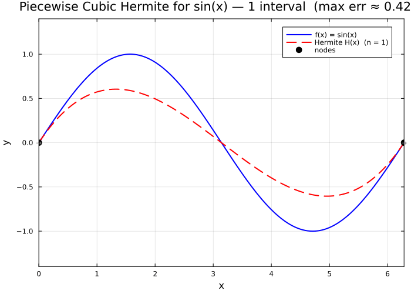

← [Numerical Methods](../)

Source inspiration: [@mathewsSite].

## Description

Hermite polynomial interpolation extends ordinary node-value interpolation by matching both function values and first derivatives at interpolation nodes. For two endpoints $x_0,x_1$ with $h=x_1-x_0$ and $t=(x-x_0)/h$, the cubic Hermite interpolant is

$$
H(x)=y_0H_{00}(t)+hy_0'H_{10}(t)+y_1H_{01}(t)+hy_1'H_{11}(t),
$$

where $H_{00},H_{10},H_{01},H_{11}$ are the standard cubic Hermite basis functions. In piecewise form over many subintervals, this gives a smooth $C^1$ approximation that preserves both value and slope information at each node.

## Animations

These animations illustrate the cubic Hermite polynomial, which interpolates both function values **and** first derivatives at the endpoint nodes. Unlike ordinary polynomial interpolation, Hermite interpolation matches the slope at each node, giving a smoother fit.

Julia source scripts that generated these animations are linked under each case.

### Case 1 — Piecewise cubic Hermite for $\sin(x)$, refining the mesh

**Behavior:** Piecewise cubic Hermite interpolation uses $n$ subintervals, each carrying a cubic polynomial that matches $f$ and $f'$ at its two endpoints. Doubling $n$ decreases the maximum error by approximately $2^4 = 16$, consistent with the $O(h^4)$ convergence rate.

[Julia source](hermitepolyaa.jl)

### Case 2 — Hermite basis functions building the interpolant of $e^x$ on $[0,1]$

**Behavior:** The four cubic Hermite basis functions $H_{00}$, $H_{10}$, $H_{01}$, $H_{11}$ each carry one degree of freedom (a value or derivative at an endpoint). Their weighted combination $H(x) = y_0 H_{00} + h y_0' H_{10} + y_1 H_{01} + h y_1' H_{11}$ equals the true function at both endpoints and matches the slope there.

[Julia source](hermitepolybb.jl)

![Four Hermite basis function contributions for e^x on [0,1] revealed one at a time and summed to form the complete cubic Hermite interpolant](hermitepolybb.gif)

