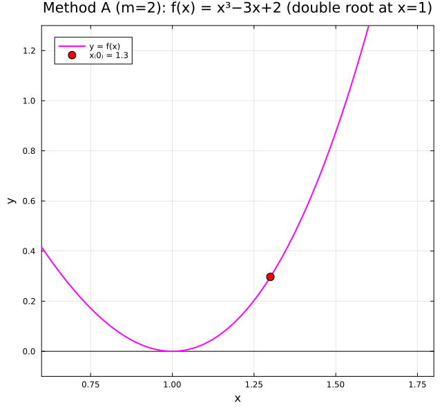
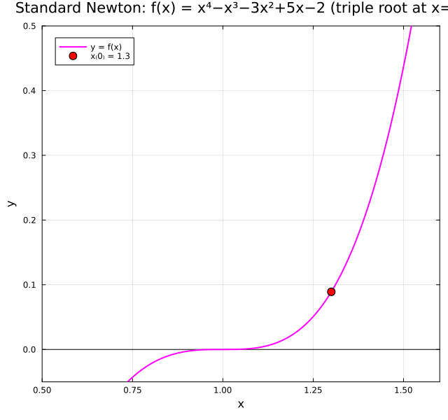

← [Numerical Methods](../)

Source inspiration:  [@mathewsSite].

## Animations

Each animation below shows the **tangent-line diagram** for Newton-type iterations on functions with multiple roots.
At each iterate $x_n$, the line connecting $(x_n, f(x_n))$ to the next iterate's x-intercept traces the convergence path.
Standard Newton-Raphson degrades to linear convergence at multiple roots; Method A (accelerated) restores quadratic convergence by multiplying the Newton step by the root's multiplicity $m$.

Julia source scripts that generated these animations are linked under each case.

### Case 1 — Standard Newton, linear convergence (double root), $f(x) = x^3 - 3x + 2$, $x_0 = 1.3$

**Behavior:** $f(x) = x^3 - 3x + 2 = (x-1)^2(x+2)$ has a double root at $x^* = 1$.
Because $f'(x^*) = 0$ at a multiple root, the standard convergence proof breaks down.
Each step only halves the error rather than squaring it — the iteration creeps slowly toward $x = 1$ over many steps.

[Julia source](newtonimpaa.jl)

### Case 2 — Method A (accelerated, $m=2$), quadratic convergence, $f(x) = x^3 - 3x + 2$, $x_0 = 1.3$

**Behavior:** Method A uses $x_{n+1} = x_n - m \cdot \tfrac{f(x_n)}{f'(x_n)}$ with $m = 2$ (the known multiplicity).
The enlarged step compensates for the vanishing derivative at the double root, restoring quadratic convergence.
Compare the rapid convergence here against the slow Case 1 — same function, same starting point, completely different speed.

[Julia source](newtonimpbb.jl)

### Case 3 — Standard Newton, even slower convergence (triple root), $f(x) = x^4 - x^3 - 3x^2 + 5x - 2$, $x_0 = 1.3$

**Behavior:** $f(x) = (x-1)^3(x+2)$ has a triple root at $x^* = 1$.
The asymptotic error constant for standard Newton at an order-$m$ root is $(m-1)/m$.
For a triple root this is $2/3$, meaning each iterate only reduces the error by $1/3$ — even slower than the double-root case.

[Julia source](newtonimpcc.jl)

### Case 4 — Method A (accelerated, $m=3$), quadratic convergence, $f(x) = x^4 - x^3 - 3x^2 + 5x - 2$, $x_0 = 1.3$

**Behavior:** Method A with $m = 3$ (the correct multiplicity) restores quadratic convergence at the triple root.
The convergence is dramatic compared to Case 3 — the iterate reaches $x \approx 1$ in just a couple of steps.
This illustrates the core advantage of the improved methods: knowing $m$ unlocks quadratic convergence regardless of root order.

[Julia source](newtonimpdd.jl)

### Case 5 — Standard Newton diverges, $f(x) = \arctan(x)$, $x_0 = 1.4$

**Behavior:** $f(x) = \arctan(x)$ has a simple root at $x^* = 0$.
Newton-Raphson converges only when $|x_0| < x_c \approx 1.3917$; starting at $x_0 = 1.4$ — just outside that radius — each tangent line overshoots further than the previous iterate, and the iterates escape toward $\pm\infty$.
Note that Methods A, B, and C **do not fix this case** — they are designed to restore quadratic convergence at multiple roots, not to handle divergence caused by a flat-tailed function.
Method C searches for $m = 1, 2, 3, \ldots$ such that $|x_{n,m} - p| < |x_{n,m-1} - p|$, but for $\arctan$ at $x_0 = 1.4$ the $m=1$ step already overshoots to $x_1 \approx -1.41$, and larger $m$ moves further away — the search never succeeds.
This is a cautionary example showing that even the improved methods have limits: they address multiplicity, not general global-convergence failures.

[Julia source](newtonimpee.jl)

## Derivation Notes (Planned)

Short derivations will be added to explain the core equations and assumptions.

## Worked Example (Planned)

A compact numerical example with intermediate steps will be included.

## Implementation Notes (Planned)

Implementation details, numerical stability notes, and practical pitfalls will be added.
