← [Numerical Methods](../)

Source inspiration: [@mathewsSite].

## Description

Lagrange interpolation builds a unique polynomial of degree at most $n$ through $n+1$ data points. In barycentric form, it is numerically stable and efficient for evaluation while keeping the same interpolant.

Given nodes $(x_i, y_i)$, the interpolation polynomial is

$$
P_n(x)=\sum_{i=0}^{n} y_i L_i(x), \qquad
L_i(x)=\prod_{j\ne i} \frac{x-x_j}{x_i-x_j}.
$$

The 29 animations below follow the legacy Mathews case ordering and use equally spaced nodes on the listed node intervals.

## Animations

Each animation increases polynomial degree one step at a time for a fixed function and interval.

[Julia source for all cases](lagnewt_animations_all.jl)

### Case 01

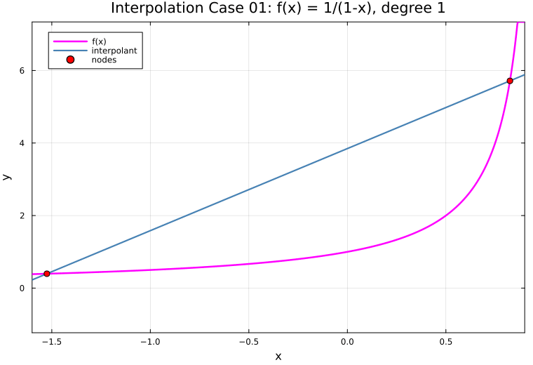

### Case 02

### Case 03

### Case 04

### Case 05

### Case 06

### Case 07

### Case 08

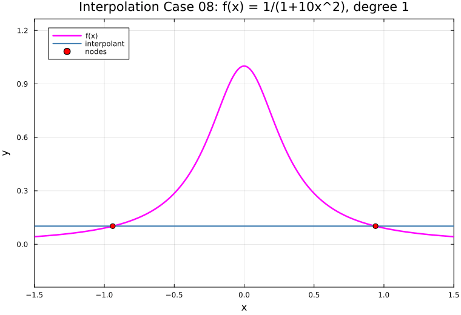

### Case 09

### Case 10

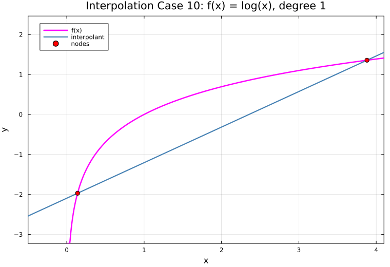

### Case 11

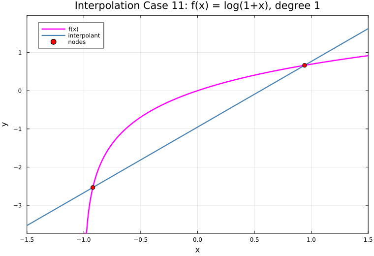

### Case 12

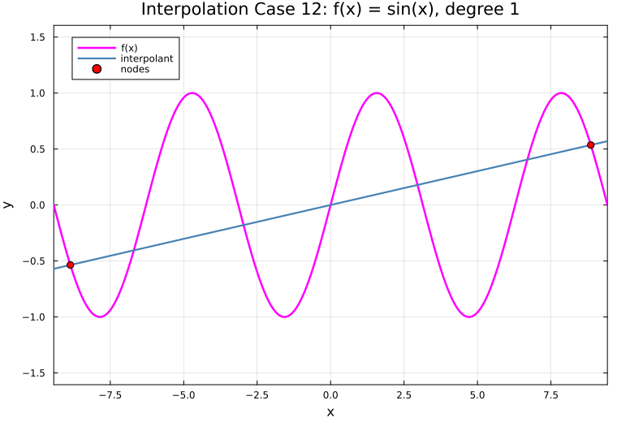

### Case 13

### Case 14

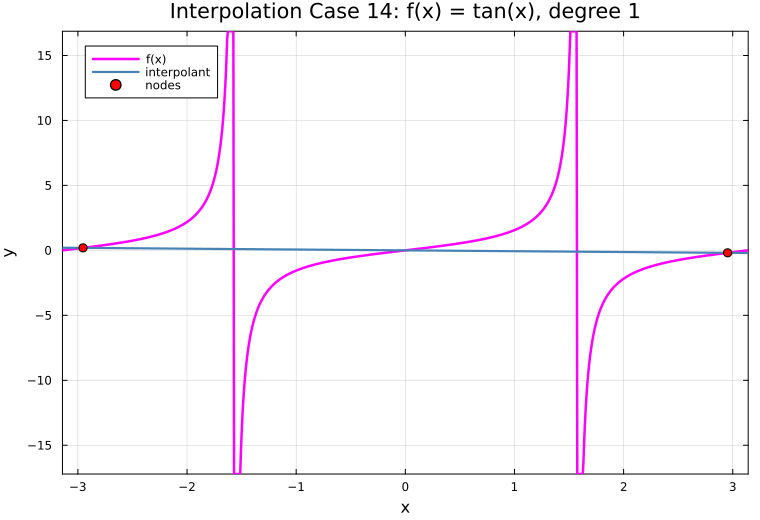

### Case 15

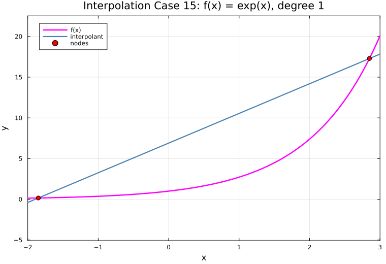

### Case 16

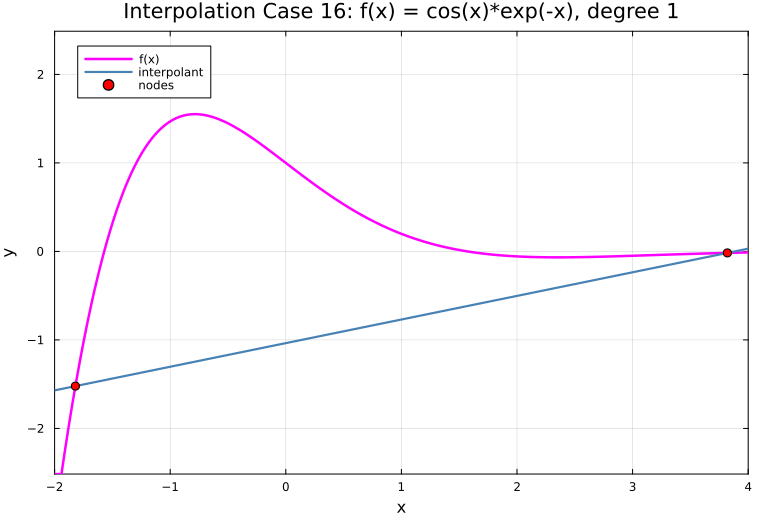

### Case 17

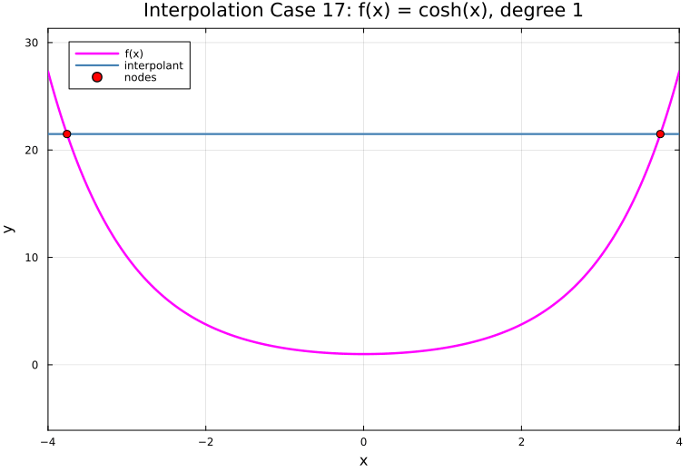

### Case 18

### Case 19

### Case 20

### Case 21

### Case 22

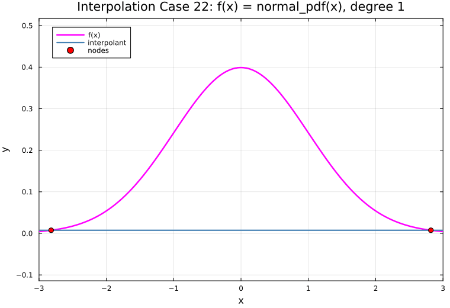

### Case 23

### Case 24

### Case 25

### Case 26

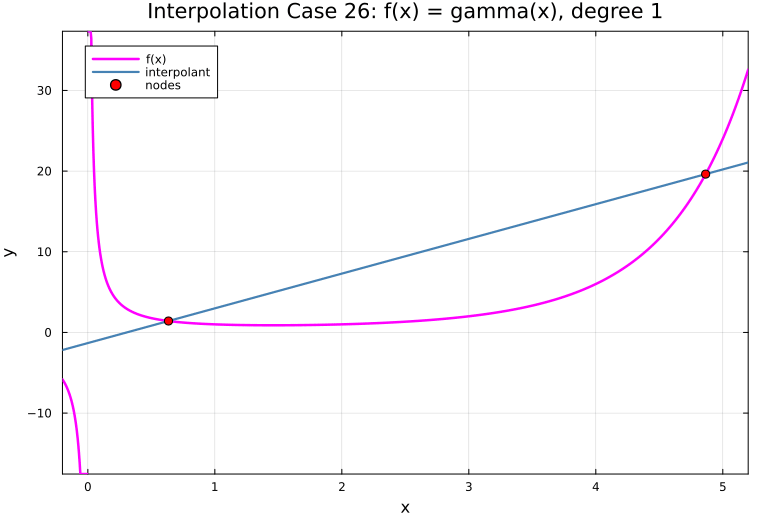

### Case 27

### Case 28

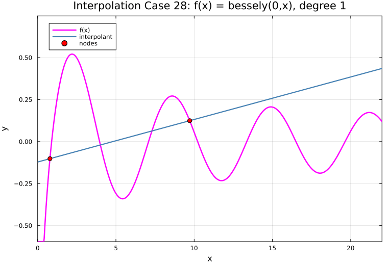

### Case 29

## Derivation Notes (Planned)

Short derivations will be added for interpolation error bounds and node-placement effects.
