← [Numerical Methods](../)

Source inspiration: [@mathewsSite].

## Description

The Laurent series of a function around a center $x_0$ is

$$
f(x)=\sum_{k=-\infty}^{\infty} a_k (x-x_0)^k,
$$

which extends Taylor series by allowing negative powers. Those negative-power terms form the principal part and capture pole-like behavior. In many smooth cases centered away from singularities, the principal part is zero and the Laurent series reduces to an ordinary Taylor expansion.

## Animations

The Laurent animation for this topic reuses the same 27 function/interval/center cases used on the Padé page, but draws Laurent-series truncations instead of rational Padé forms.

Each frame uses a two-sided truncation with both negative and positive powers at the same time,

$$
\sum_{k=-N}^{N} a_k (x-x_0)^k,
$$

with $N$ increasing frame by frame.

Each case below follows the same case ordering as the Padé suite (Case 01 through Case 27).

[Julia source for all cases](laurent_animations_all.jl)

### Case 01 — $f(x)=\sqrt{x}$, $x_0=1$, $x\in[0,10.5]$

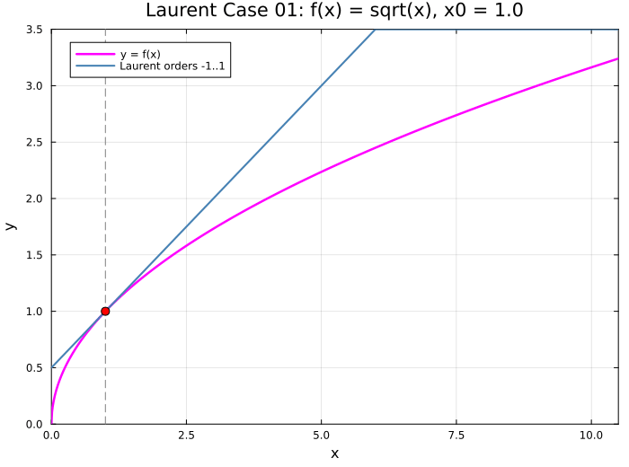

### Case 02 — $f(x)=\sqrt{x}$, $x_0=4$, $x\in[0,10.5]$

### Case 03 — $f(x)=\sqrt{x}$, $x_0=5$, $x\in[0,10.5]$

### Case 04 — $f(x)=\dfrac{1}{\sqrt{1-x}}$, $x_0=0$, $x\in[-1.5,1.5]$

### Case 05 — $f(x)=\log(x)$, $x_0=1$, $x\in[-0.5,4.1]$

### Case 06 — $f(x)=\log(x)$, $x_0=2$, $x\in[-0.5,4.1]$

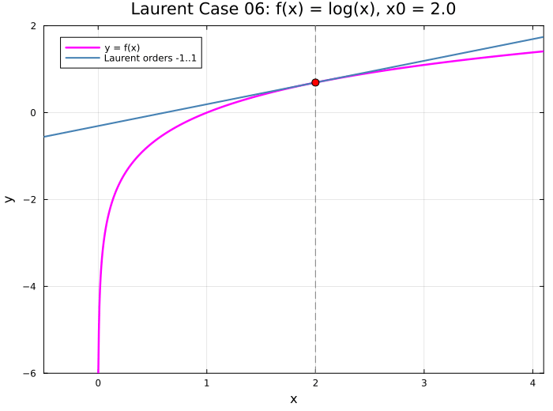

### Case 07 — $f(x)=\log(1+x)$, $x_0=0$, $x\in[-1.5,1.5]$

### Case 08 — $f(x)=\sin(x)$, $x_0=0$, $x\in[-3\pi,3\pi]$

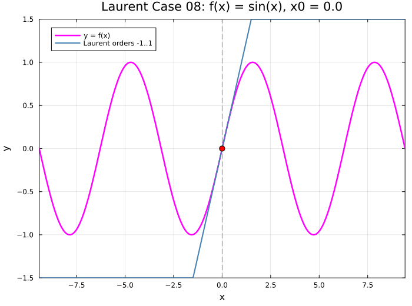

### Case 09 — $f(x)=\cos(x)$, $x_0=0$, $x\in[-3\pi,3\pi]$

### Case 10 — $f(x)=\sin(x)$, $x_0=\pi/4$, $x\in[-7\pi/4,9\pi/4]$

### Case 11 — $f(x)=\cos(x)$, $x_0=\pi/3$, $x\in[-5\pi/3,7\pi/3]$

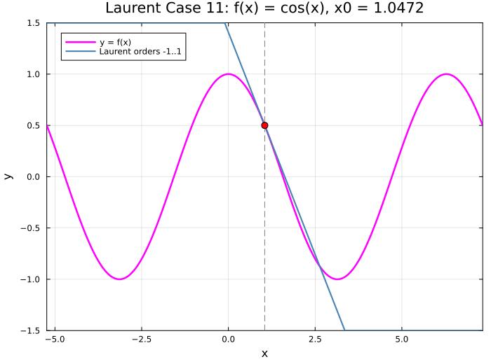

### Case 12 — $f(x)=\tan(x)$, $x_0=0$, $x\in[-\pi,\pi]$

### Case 13 — $f(x)=e^x$, $x_0=0$, $x\in[-2,3]$

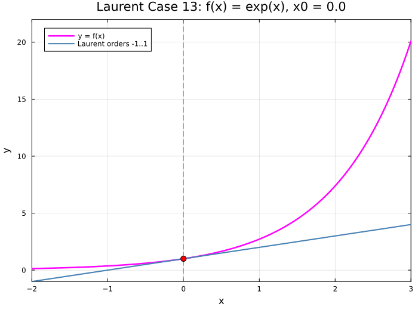

### Case 14 — $f(x)=e^{-x}\cos(x)$, $x_0=0$, $x\in[-2,4]$

### Case 15 — $f(x)=\cosh(x)$, $x_0=0$, $x\in[-4,4]$

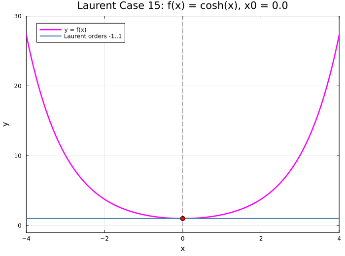

### Case 16 — $f(x)=\arctan(x)$, $x_0=0$, $x\in[-2,2]$

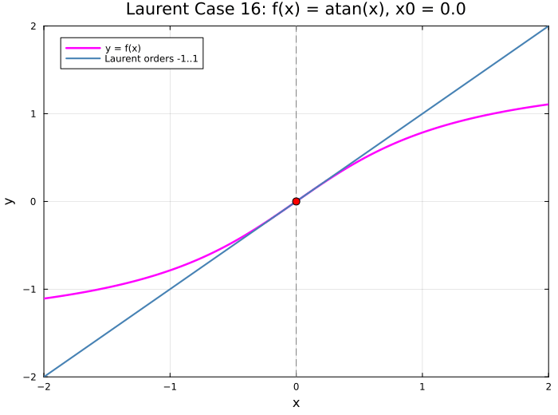

### Case 17 — $f(x)=\arcsin(x)$, $x_0=0$, $x\in[-1.5,1.5]$

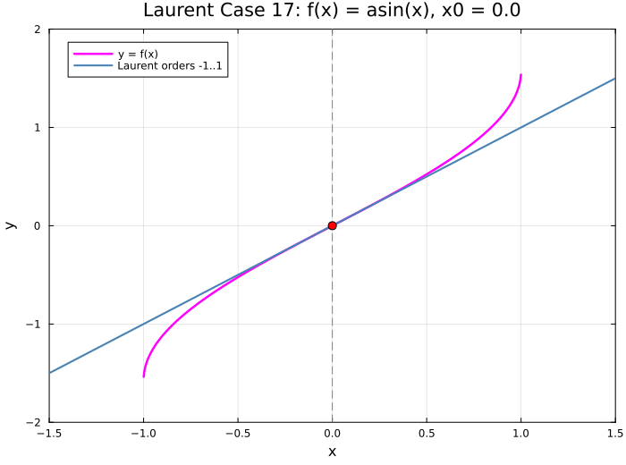

### Case 18 — $f(x)=J_0(x)$, $x_0=0$, $x\in[-10.2,10.2]$

### Case 19 — $f(x)=J_1(x)$, $x_0=0$, $x\in[-10.2,10.2]$

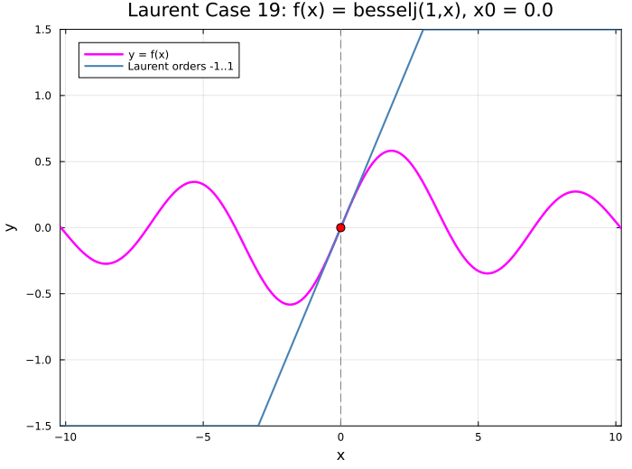

### Case 20 — $f(x)=\dfrac{1}{\sqrt{2\pi}}e^{-x^2/2}$, $x_0=0$, $x\in[-3,3]$

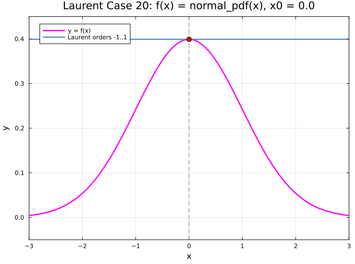

### Case 21 — $f(x)=\dfrac{1}{2}+\dfrac{1}{2}\operatorname{erf}\!\left(\dfrac{x}{\sqrt{2}}\right)$, $x_0=0$, $x\in[-3,3]$

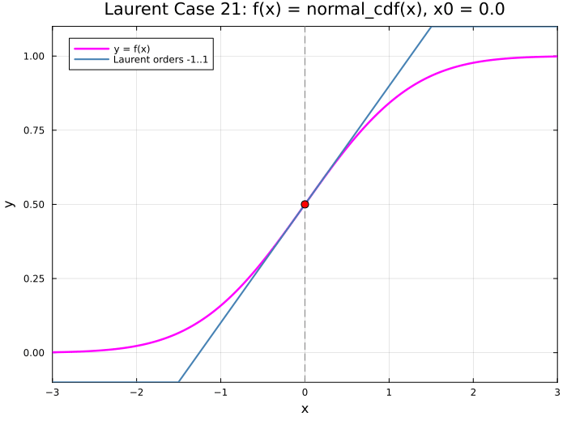

### Case 22 — $f(x)=\Gamma(x)$, $x_0=1$, $x\in[-0.2,5.2]$

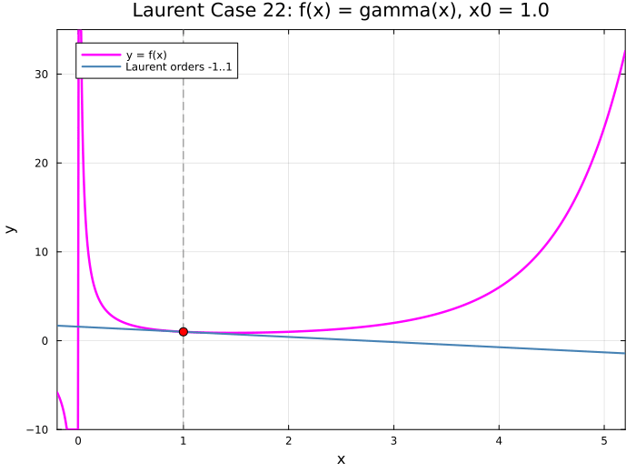

### Case 23 — $f(x)=\Gamma(x)$, $x_0=2$, $x\in[-0.2,5.2]$

### Case 24 — $f(x)=\Gamma(x)$, $x_0=3$, $x\in[-0.2,5.2]$

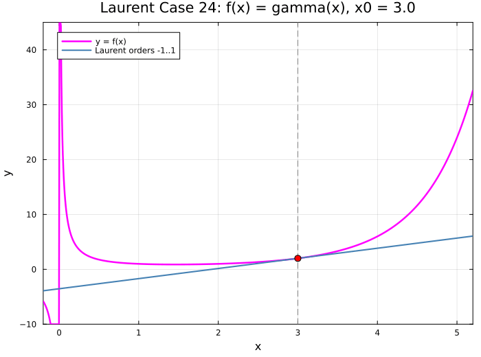

### Case 25 — $f(x)=Y_0(x)$, $x_0=10$, $x\in[0,22]$

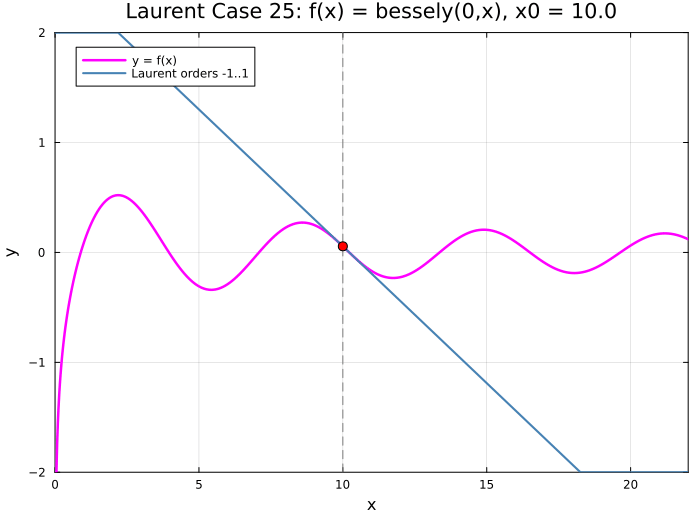

### Case 26 — $f(x)=Y_0(x)$, $x_0=5$, $x\in[0,22]$

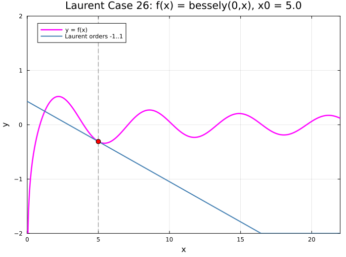

### Case 27 — $f(x)=Y_0(x)$, $x_0=2$, $x\in[0,22]$

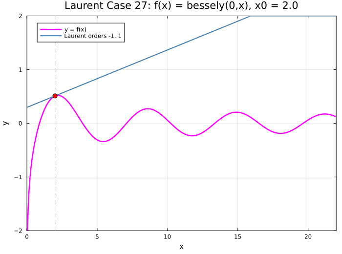
