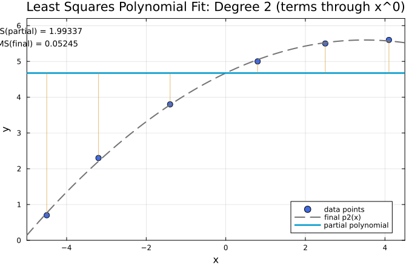
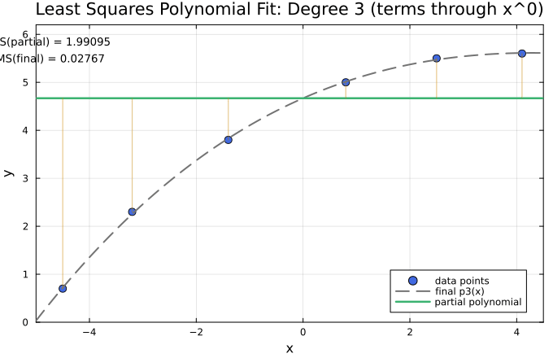
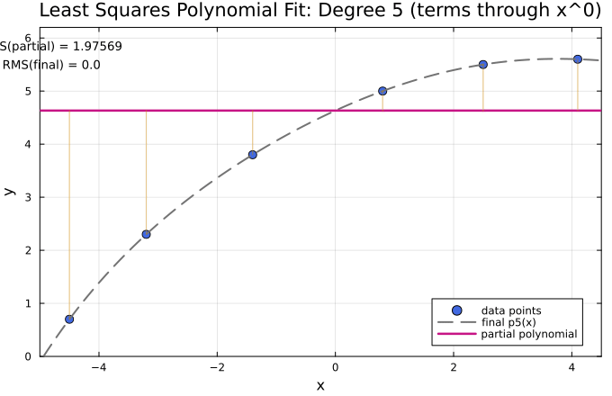

← [Numerical Methods](../)

Source inspiration: [@mathewsSite].

## Description

Given data points $(x_i,y_i)$, the least-squares polynomial of degree $m$

$$p_m(x)=a_0+a_1x+a_2x^2+\cdots+a_mx^m$$

is chosen to minimize the total squared error

$$E(a_0,\ldots,a_m)=\sum_{i=1}^{n}\left(p_m(x_i)-y_i\right)^2.$$

Setting the partial derivatives of $E$ to zero gives the normal equations, which in matrix form are

$$\left(V^T V\right)\mathbf{a}=V^T\mathbf{y},$$

where $V$ is the Vandermonde-style design matrix. Once the coefficients are found, the fit quality is often summarized with the root-mean-square error

$$\mathrm{RMS}=\sqrt{\frac{1}{n}\sum_{i=1}^{n}\left(p_m(x_i)-y_i\right)^2}.$$

The legacy examples on this page use the six data points

$$(-4.5,0.7),\;(-3.2,2.3),\;(-1.4,3.8),\;(0.8,5.0),\;(2.5,5.5),\;(4.1,5.6).$$

As the degree increases from 2 to 5, RMS decreases, but this does not always mean better behavior outside the data interval. High-degree polynomial fits can exhibit oscillations ("polynomial wiggle") and poor extrapolation.

## Animations

Each animation below shows the **term-by-term construction** of the least-squares polynomial fit for the same dataset. The blue points are the data, the gray dashed curve is the final fitted polynomial, and the solid colored curve is the partial polynomial built from terms up to degree $k$.

Julia source scripts that generated these animations are linked under each case.

### Case 1 - Quadratic fit, $m=2$

**Behavior:** The quadratic captures the main concave-down trend well, with small residuals near the center and slightly larger error near the ends. This is the baseline smooth fit used in the module.

$$p_2(x)=4.67425 + 0.52861x - 0.07563x^2,\qquad \mathrm{RMS}\approx 0.05245.$$

[Julia source](leastsqpolyaa.jl)

### Case 2 - Cubic fit, $m=3$

**Behavior:** Adding the cubic term improves local flexibility and lowers RMS. The fit tracks the left and right tails a bit more closely while remaining stable across the plotted interval.

$$p_3(x)=4.66863 + 0.48939x - 0.07424x^2 + 0.00268x^3,\qquad \mathrm{RMS}\approx 0.02767.$$

[Julia source](leastsqpolyab.jl)

### Case 3 - Quartic fit, $m=4$

**Behavior:** The quartic noticeably reduces residuals and follows the subtle curvature changes between middle and right-side points. RMS drops by about a factor of four compared with the cubic.

$$p_4(x)=4.62863 + 0.49669x - 0.05823x^2 + 0.00201x^3 - 0.00080x^4,\qquad \mathrm{RMS}\approx 0.00734.$$

[Julia source](leastsqpolyac.jl)

### Case 4 - Quintic fit, $m=5$

**Behavior:** With six data points and degree 5, the polynomial interpolates all points essentially exactly, so RMS is near machine precision. This illustrates why a degree-$n-1$ polynomial can match $n$ distinct points, but it may still be fragile for extrapolation.

$$p_5(x)=4.63232 + 0.50885x - 0.06063x^2 - 0.00074x^3 - 0.00065x^4 + 0.00012x^5,\qquad \mathrm{RMS}\approx 2.9\times 10^{-15}.$$

[Julia source](leastsqpolyad.jl)

