← [Numerical Methods](../)

Source inspiration: [@mathewsSite].

## Description

Taylor Series is an infinite sum of monomial terms. Taylor series acts like a polynomial with infinite terms. It has similar properties to polynomials, such as not having horizontal or vertical asymptotes. This is helpful for understanding when the Taylor series converges or doesn't converge. For functions that are infinitely differentiable but have asymptotes ($arctan(x)$, rational functions, $tanh(x)$), the Taylor series will converge locally but not globally. For functions that do not behave like polynomials (grows slower or faster) but are infinitely differentiable, the Taylor series can converge locally but not globally ($log(x)$). The Taylor series will converge globally for functions that behave like polynomials ($exp(x)$).

Maclaurin and Taylor polynomials approximate a smooth function locally by truncating a power series. For center $x_0$, the degree-$n$ Taylor polynomial is

$$
T_n(x)=\sum_{k=0}^{n}\frac{f^{(k)}(x_0)}{k!}(x-x_0)^k.
$$

The Maclaurin polynomial is the special case $x_0=0$. Near singularities or non-smooth points, series may converge locally but fail globally.

A strong understanding of the Taylor series helps understand many numerical methods. Taylor series is often used in numerical methods to describe "the order of accuracy" or "order of convergence" of a particular numerical method. For instance, in numerical integration, a method is second-order accurate if it accurately estimates the Taylor series' constant, linear, and quadratic terms.

Other infinite series exist, such as the Laurent or the Power series. Padé approximant is very similar to a truncated Taylor series but is instead a ratio of two polynomials. Laurent, Power, and Padé approximant may be discussed on other Numerical Methods pages.

## Outside Links

1. [Taylor Series at Wolfram MathWorld](https://mathworld.wolfram.com/TaylorSeries.html)
2. [Taylor Series on Wikipedia](https://en.wikipedia.org/wiki/Taylor_series)

## Video Animations

This section keeps some video animations I created before generated the GIFs.  They have a different aesthetic than the GIFs. The videos are generated by a MATLAB script:

[taylor_series_animation_code.m](taylor_series_animation_code.m)

### Exponential Cases, $exp(x)$ about 0 and 1

The Taylor series of $exp(x)$ about 0 has an infinite radius of convergence. Higher and higher-order Taylor series truncations converge more and more to $exp(x)$. $exp(x)$ about 1 is similar to $exp(x)$ about 0, except that the expansion point is 1.





### Sine Cases, $sin(x)$ about 0 and 0.5

Sine behaves similarly to a polynomial locally, so the Taylor series converges. The radius of convergence is infinite.





### Hyperbolic Tangent Cases, $tanh(x)$ about 0 and 0.5

Tanh has two horizontal asymptotes. The Taylor series has a limited radius of convergence.





### Inverse Tangent Cases, $arctan(x)$ about 0 and 0.5

arctan has two horizontal asymptotes similar to tanh. The radius of convergence is limited.





### Rational and Singular Cases, $1/x$ about 0.5 and $1/(x-1)$ about 0.75





### Non-Smooth Case, $sqrt(abs(x))*sign(x)$ about 0.5

This function contains two discontinuous functions, abs and sign. This function often is used by engineers to simulate lump parameter fluid flow. This function is a poor choice because of the infinite derivative at x=0 of the sqrt function and the discontinuities of sign and abs. The Taylor series cannot converge across x=0.



## Animations

Each animation shows a smooth transition between successive partial sums overlaid on the target function.

All 31 GIFs on this page are generated by one Julia script:

[Julia source for all cases](series_animations_all.jl)

### Maclaurin Cases (18)

### M01 - $f(x)=\dfrac{1}{1-x}$, $x_0=0$, $x\in[-1.5,1.5]$

### M02 - $f(x)=\dfrac{1}{1+x}$, $x_0=0$, $x\in[-1.5,1.5]$

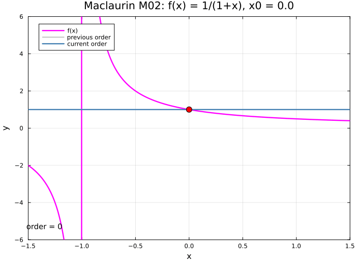

### M03 - $f(x)=\dfrac{1}{(1-x)^2}$, $x_0=0$, $x\in[-1.5,1.5]$

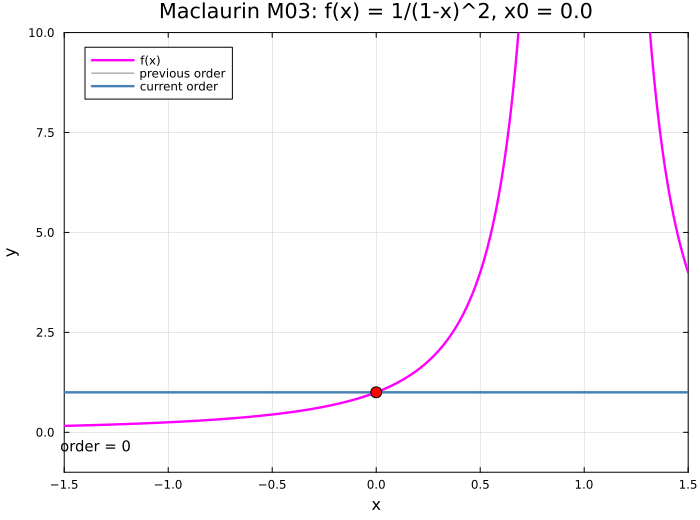

### M04 - $f(x)=\dfrac{1}{\sqrt{1-x}}$, $x_0=0$, $x\in[-1.5,1.5]$

### M05 - $f(x)=\dfrac{1}{1+x^2}$, $x_0=0$, $x\in[-1.5,1.5]$

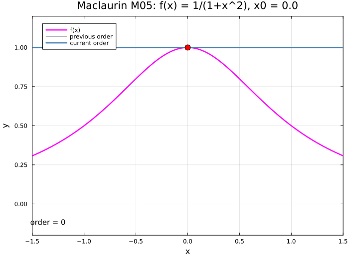

### M06 - $f(x)=\log(1+x)$, $x_0=0$, $x\in[-1.5,1.5]$

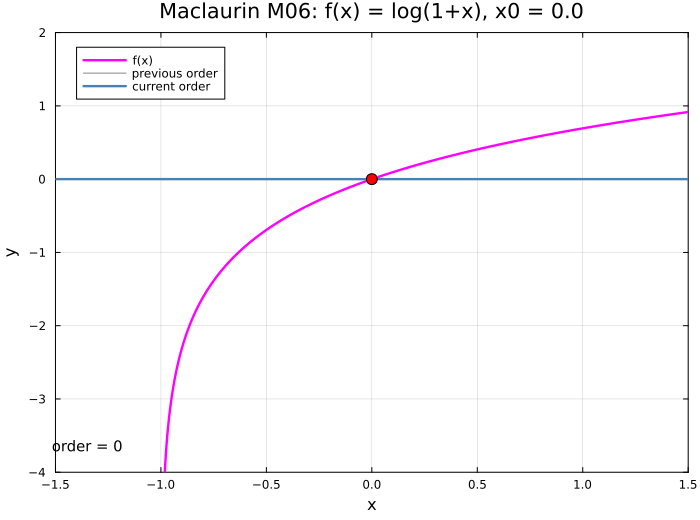

### M07 - $f(x)=\sin(x)$, $x_0=0$, $x\in[-3\pi,3\pi]$

### M08 - $f(x)=\cos(x)$, $x_0=0$, $x\in[-3\pi,3\pi]$

### M09 - $f(x)=\tan(x)$, $x_0=0$, $x\in[-\pi,\pi]$

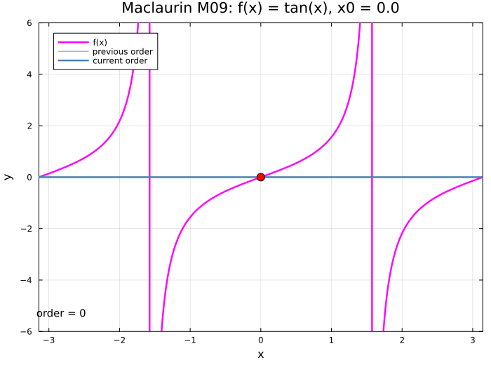

### M10 - $f(x)=e^{-x^2/2}$, $x_0=0$, $x\in[-2,3]$

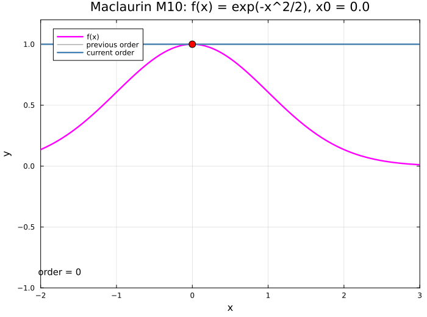

### M11 - $f(x)=e^{-x}\cos(x)$, $x_0=0$, $x\in[-2,4]$

### M12 - $f(x)=\cosh(x)$, $x_0=0$, $x\in[-4,4]$

### M13 - $f(x)=\arctan(x)$, $x_0=0$, $x\in[-2,2]$

### M14 - $f(x)=\arcsin(x)$, $x_0=0$, $x\in[-1.5,1.5]$

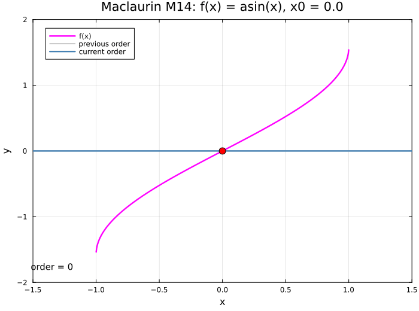

### M15 - $f(x)=J_0(x)$, $x_0=0$, $x\in[-10.2,10.2]$

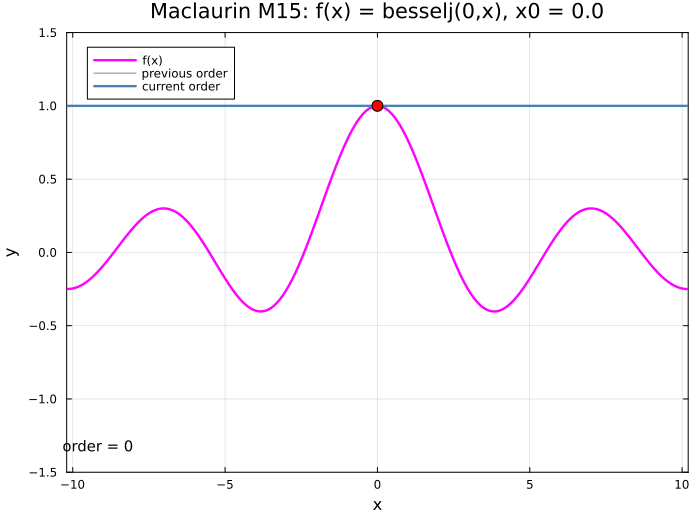

### M16 - $f(x)=J_1(x)$, $x_0=0$, $x\in[-10.2,10.2]$

### M17 - $f(x)=\dfrac{1}{\sqrt{2\pi}}e^{-x^2/2}$, $x_0=0$, $x\in[-3,3]$

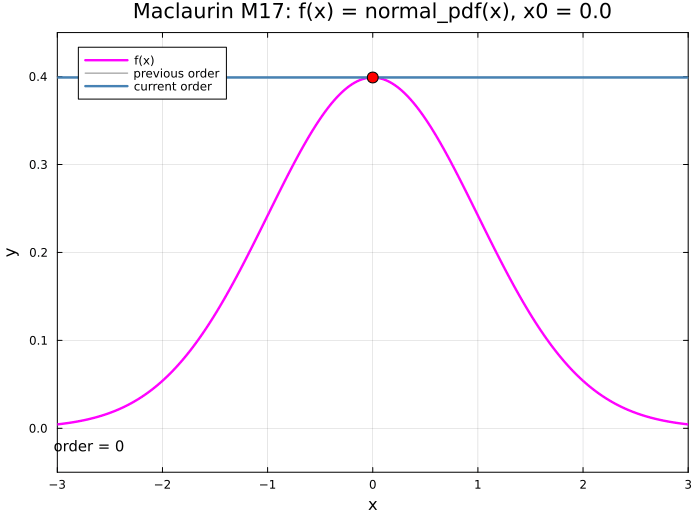

### M18 - $f(x)=\dfrac{1}{2}+\dfrac{1}{2}\operatorname{erf}\!\left(\dfrac{x}{\sqrt{2}}\right)$, $x_0=0$, $x\in[-3,3]$

### Taylor Cases (13)

### T01 - $f(x)=\sqrt{x}$, $x_0=1$, $x\in[0,10.5]$

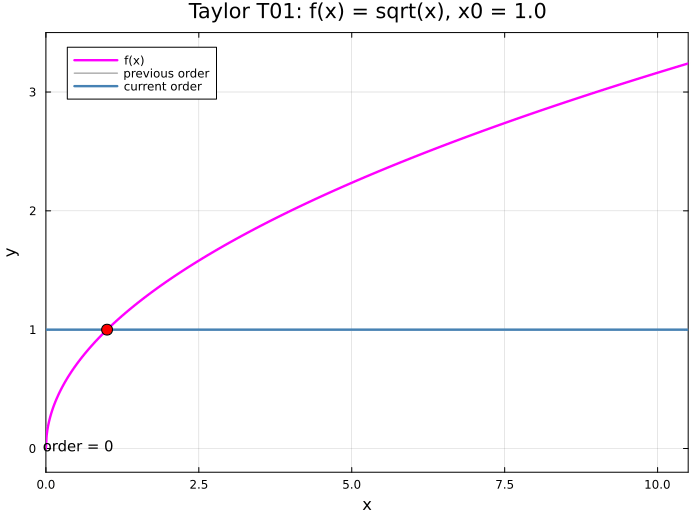

### T02 - $f(x)=\sqrt{x}$, $x_0=4$, $x\in[0,10.5]$

### T03 - $f(x)=\sqrt{x}$, $x_0=5$, $x\in[0,10.5]$

### T04 - $f(x)=\log(x)$, $x_0=1$, $x\in[-0.5,4.1]$

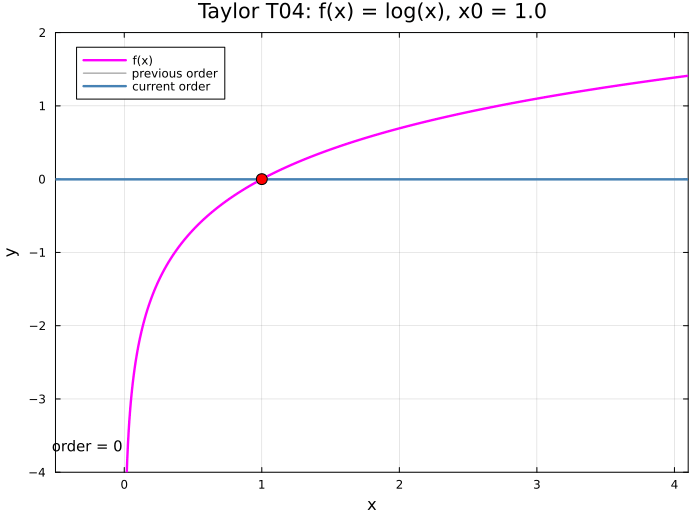

### T05 - $f(x)=\log(x)$, $x_0=2$, $x\in[-0.5,4.1]$

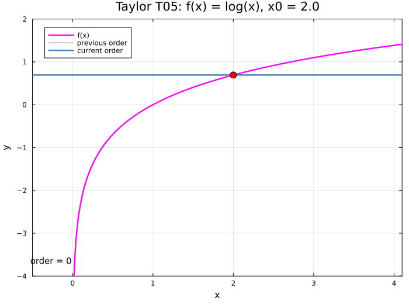

### T06 - $f(x)=\sin(x)$, $x_0=\pi/4$, $x\in[-7\pi/4,9\pi/4]$

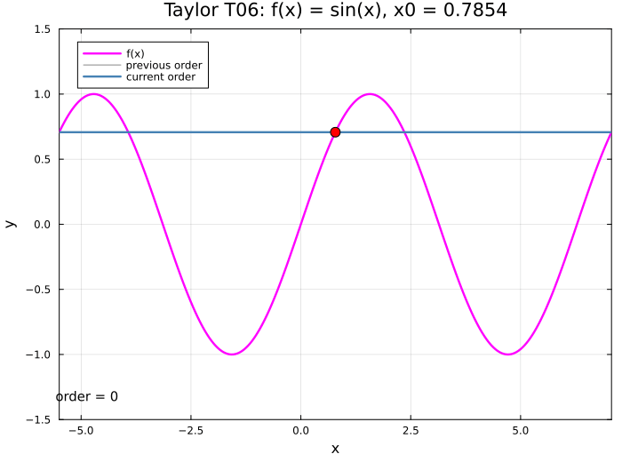

### T07 - $f(x)=\cos(x)$, $x_0=\pi/3$, $x\in[-5\pi/3,7\pi/3]$

### T08 - $f(x)=\Gamma(x)$, $x_0=2$, $x\in[-0.2,5.2]$

### T09 - $f(x)=\Gamma(x)$, $x_0=3$, $x\in[-0.2,5.2]$

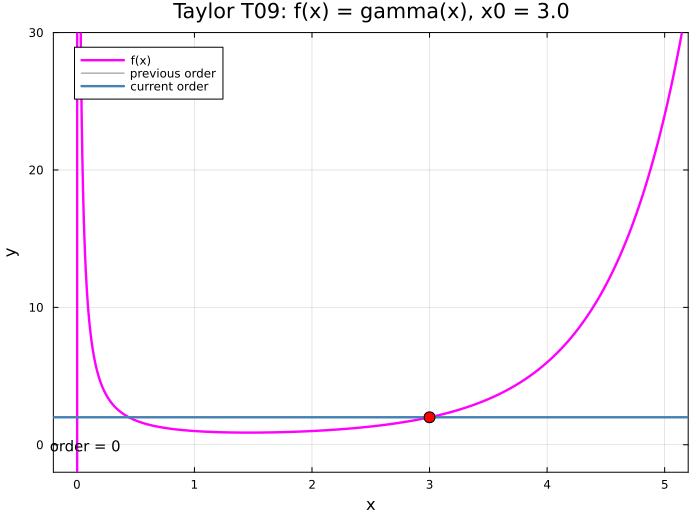

### T10 - $f(x)=\Gamma(x)$, $x_0=4$, $x\in[-0.2,5.2]$

### T11 - $f(x)=J_0(x)$, $x_0=10$, $x\in[0,22]$

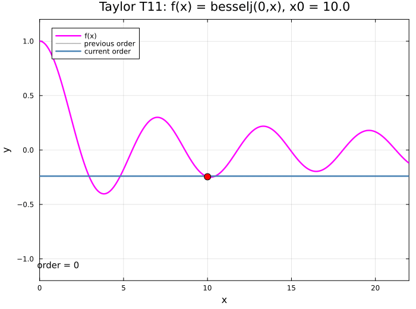

### T12 - $f(x)=J_1(x)$, $x_0=5$, $x\in[0,22]$

### T13 - $f(x)=Y_0(x)$, $x_0=2$, $x\in[0,22]$

