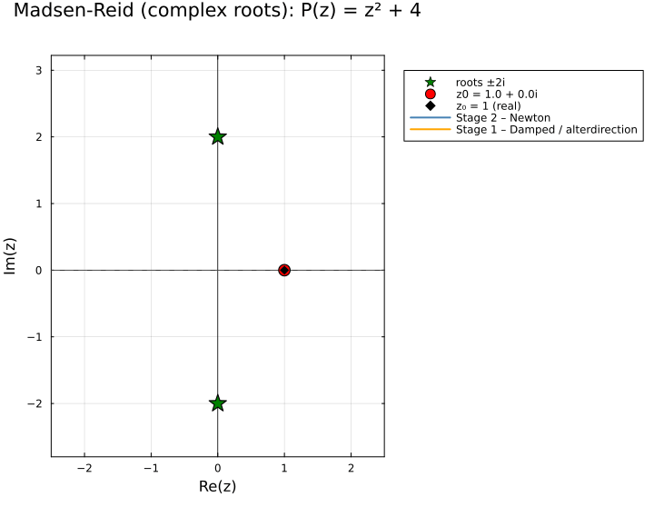

← [Numerical Methods](../)

## Description

The **Madsen-Reid method** [@madsenReid1975] is a robust, globally convergent Newton-based algorithm for finding all roots of a real-coefficient polynomial. It combines three complementary ideas into a single, practical solver:

### 1. Quadratic convergence — even at multiple roots

Standard Newton-Raphson degrades to *linear* convergence at a root of multiplicity $m > 1$ because $f'(x^*) = 0$, which inflates each step. Madsen-Reid avoids this by taking **multiple steps in the same direction** — the step-size limit $r_0$ is *increased* fivefold after each accepted step:

$$r_0 \leftarrow 5\,|\Delta z|$$

This acceleration allows the iterates to accelerate toward the root rather than stalling, recovering quadratic-like convergence in practice even when $f'(x^*)$ is small.

### 2. Safety — the dual-stage strategy

The algorithm alternates between two stages based on whether the current Newton step reduces $|f|^2$:

- **Stage 2 (Newton):** If the full Newton step $\Delta z = f(z)/f'(z)$ reduces $|f(z)|^2$, it is accepted as-is. This is the fast, quadratic phase.
- **Stage 1 (Damped):** If the full Newton step *increases* $|f(z)|^2$, the step is repeatedly halved (up to 4 times) until a reducing step is found. If halving fails, `alterdirection` rotates the step by approximately $53°$ and scales it, breaking symmetry and escaping saddle points or cycles.

The dual-stage structure guarantees that $|f(z)|^2$ is a monotonically non-increasing Lyapunov function along the iteration, giving the algorithm its global convergence character without requiring a full line search.

### 3. Efficiency — minimizing function evaluations

Higher-order methods (Halley's, Householder's) achieve cubic or higher convergence but require evaluating $f''$, $f'''$, etc. Madsen-Reid achieves rapid convergence using only **$f$ and $f'$** — the same cost as plain Newton — while the acceleration mechanism and dual-stage control make it far more reliable than unguarded Newton on difficult polynomials.

After each root is found, the polynomial is deflated (divided out), reducing the degree by 1 (real root) or 2 (complex conjugate pair), until the remaining linear or quadratic factor is solved analytically.

> **Note on generalization:** The core ideas — dual-stage damped stepping, acceleration by relaxing the step-size limit, and direction alteration near saddle points — are not limited to polynomials. The same framework can be applied to general nonlinear equations $f(x) = 0$ or systems $\mathbf{F}(\mathbf{x}) = \mathbf{0}$, where it provides a reliable alternative to trust-region methods. For polynomial root-finding specifically, the Horner-based $|f|^2$ evaluation is particularly cheap, but the algorithmic structure translates directly to general scalar and vector problems.

## Animations

Each animation shows the **iteration path** of the Madsen-Reid method. Blue segments indicate accepted Newton steps (Stage 2); orange segments indicate damped or direction-altered steps (Stage 1). The star markers show the exact root(s).

Julia source scripts that generated these animations are linked under each case.

### Case 1 — Simple root, $P(x) = x^3 - 3x - 1$, $x_0 = 3.0$

**Behavior:** Three simple real roots exist. Starting from $x_0 = 3.0$, the algorithm begins with Stage 2 Newton steps and converges rapidly to the root near $x^* \approx 1.8794$. Because $|P'(x^*)| \neq 0$, the convergence is quadratically fast with no damping needed after the first couple of frames.

[Julia source](madsreidaa.jl)

### Case 2 — Double root, $P(x) = (x-1)^2(x+2)$, $x_0 = 4.0$

**Behavior:** $P(x)$ has a double root at $x^* = 1$ where $P'(x^*) = 0$. Standard Newton-Raphson would converge only linearly here. The Madsen-Reid acceleration mechanism — growing $r_0$ fivefold each step — allows the iterates to accelerate past the stalling zone, recovering faster-than-linear convergence. Orange (Stage 1) frames show where the step is damped to control overshoot; blue (Stage 2) frames show the accelerated Newton phase. The simple root at $x = -2$ may also be found depending on which root the deflation targets first.

[Julia source](madsreidab.jl)

### Case 3 — Complex conjugate roots, $P(z) = z^2 + 4$, $z_0 = 1 + 0i$

**Behavior:** The roots are $z^* = \pm 2i$ — there are no real roots. Starting on the real axis at $z_0 = 1$, the real-axis Newton iterates cannot reach a real root and stagnate. The `alterdirection` mechanism rotates the step into the complex plane, allowing the iterates to escape the real axis. The path traces a curved trajectory in $\mathbb{C}$ converging to $z^* = +2i$. Blue segments are Stage 2 Newton steps; orange segments with direction changes are the `alterdirection` escapes. This case illustrates how the algorithm handles polynomials with no real roots starting from a real initial guess.

[Julia source](madsreidac.jl)

## References

::: {#refs}
:::
