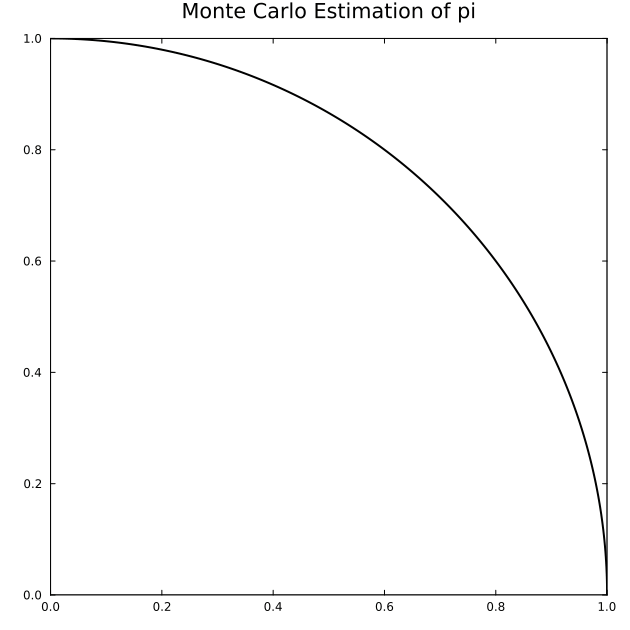

← [Numerical Methods](../)

Source inspiration: [@mathewsSite].

## Description

Monte Carlo estimation of $\pi$ samples random points uniformly in the unit square
$[0,1]\times[0,1]$ and counts how many lie inside the quarter unit disk
$x^2+y^2\le 1$.
If $n$ points are sampled and $m$ of them satisfy the disk test, then
$$
\hat\pi_n = 4\frac{m}{n}.
$$

The stochastic error decreases on the order of $1/\sqrt{n}$, so convergence is slower than high-order deterministic quadrature but robust in higher-dimensional settings.

## Animations

Each animation below shows the **Monte Carlo point-cloud estimator** for
$\pi$ in the quarter-disk geometry. Frames follow the worked-example sample sizes
$n=100, 400, 1600, 6400, 10000$.

Julia source scripts that generated these animations are linked under each case.

### Case 1 — Monte Carlo $\pi$ Estimation, Quarter Unit Disk in $[0,1]^2$

**Behavior:** Green points fall inside $x^2+y^2\le 1$ and orange points fall outside. The estimate $\hat\pi_n$ fluctuates but trends toward $\pi$ as $n$ increases.

[Julia source](montecarlopiaa.jl)

No archived animation GIF is available for this topic in the current snapshot, so this animation is reconstructed from the module examples.

