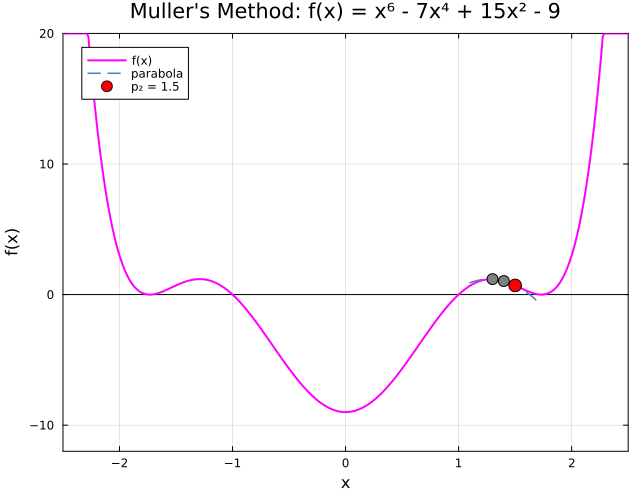

← [Numerical Methods](../)

Source inspiration:  [@mathewsSite].

## Animations

Each animation below shows **Muller's Method** fitting a parabola through three successive approximations of a root. The parabola (dashed blue) passes through the current triple $(p_0, p_1, p_2)$, and the next iterate is found where the parabola crosses the x-axis. Each frame advances one iteration: the oldest point is dropped, and the new root estimate becomes $p_2$ (red dot). The gray dots are $p_0$ and $p_1$.

Julia source scripts that generated these animations are linked under each case.

### Case 1 — Convergent, $f(x) = x^3 - 3x + 2$, double root at $p = 1$

**Behavior:** The method converges to the double root $p = 1$ of $f(x) = (x-1)^2(x+2)$. Starting near $p_2 = 2.0$, the iterates approach $p = 1$ with order $\approx 1.84$ convergence — faster than Newton's method, which has only linear convergence on double roots.

[Julia source](mullersaa.jl)

### Case 2 — Convergent, $f(x) = \sin(x^2 - 2)(x^2 - 2)$, double root at $p = \sqrt{2}$

**Behavior:** The method converges to the double root $p = \sqrt{2} \approx 1.4142$ starting from $p_2 = 1.0$. The function has a double root where $x^2 - 2 = 0$ since both factors vanish simultaneously, and Muller's method locates it efficiently despite the flat tangent at the root.

[Julia source](mullersbb.jl)

### Case 3 — Convergent, $f(x) = x^6 - 7x^4 + 15x^2 - 9$, double root near $x = 2$

**Behavior:** The function factors as $(x^2-1)(x^2-3)^2$, giving a double root at $p = \sqrt{3} \approx 1.7321$. Starting from $p_2 = 1.5$, Muller's method converges to the double root. Newton's method would converge linearly here; Muller's method converges superlinearly with order $\approx 1.84$.

[Julia source](mullerscc.jl)

