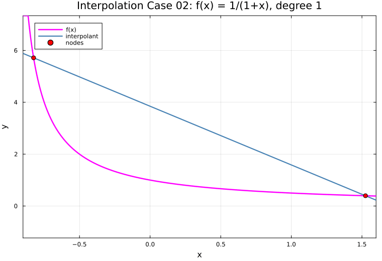
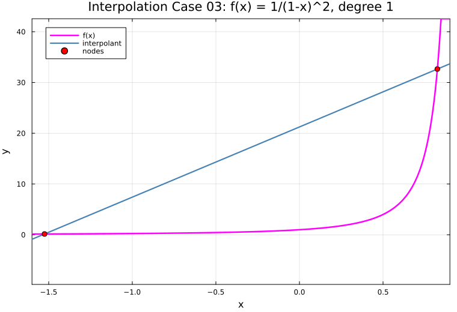
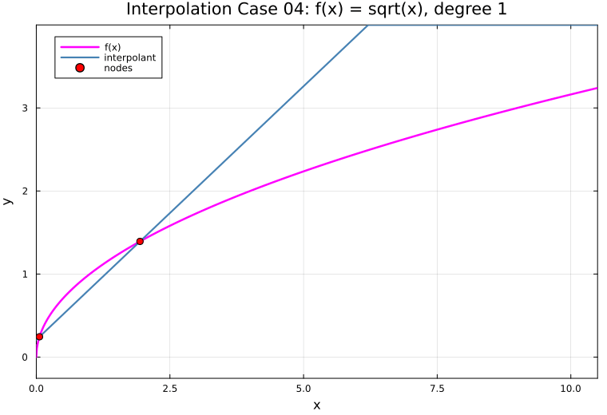
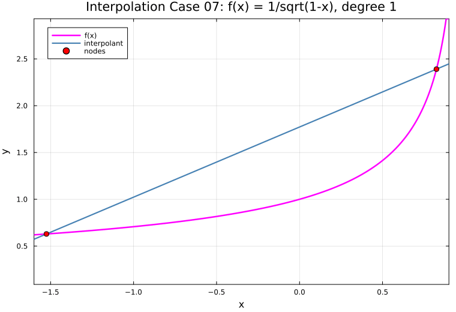
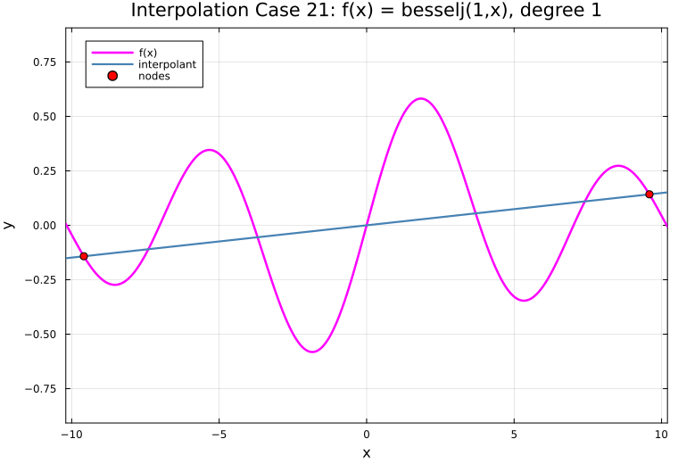
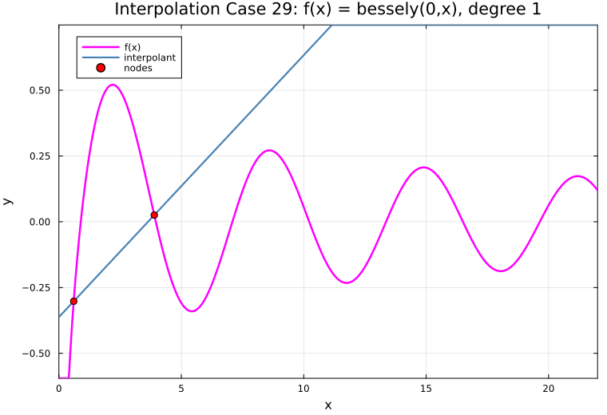

← [Numerical Methods](../)

Source inspiration: [@mathewsSite].

## Description

Newton interpolation represents the interpolating polynomial in divided-difference form,

$$
P_n(x)=a_0 + a_1(x-x_0)+a_2(x-x_0)(x-x_1)+\cdots+a_n\prod_{j=0}^{n-1}(x-x_j),
$$

where $a_k=f[x_0,\ldots,x_k]$ are divided differences. For the same nodes and data, Newton and Lagrange forms produce the same polynomial; they differ only in representation and numerical workflow.

The 29 animations below intentionally reuse the same interpolation cases as the Lagrange page, matching the legacy Mathews case ordering.

## Animations

Each animation increases polynomial degree one step at a time for a fixed function and interval.

[Julia source for all cases](lagnewt_animations_all.jl)

### Case 01

### Case 02

### Case 03

### Case 04

### Case 05

### Case 06

### Case 07

### Case 08

### Case 09

### Case 10

### Case 11

### Case 12

### Case 13

### Case 14

### Case 15

### Case 16

### Case 17

### Case 18

### Case 19

### Case 20

### Case 21

### Case 22

### Case 23

### Case 24

### Case 25

### Case 26

### Case 27

### Case 28

### Case 29

## Derivation Notes (Planned)

Short derivations will be added for divided differences, nested evaluation, and incremental updates.
