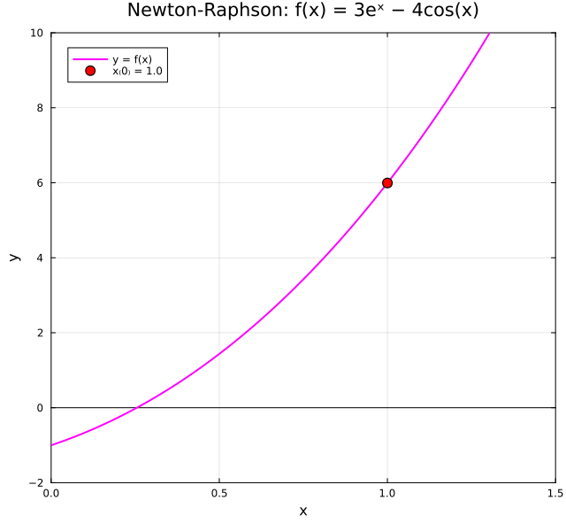
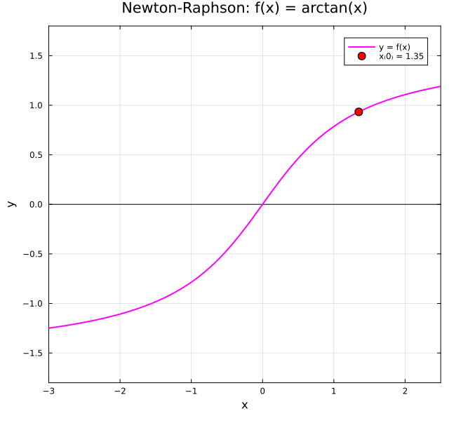
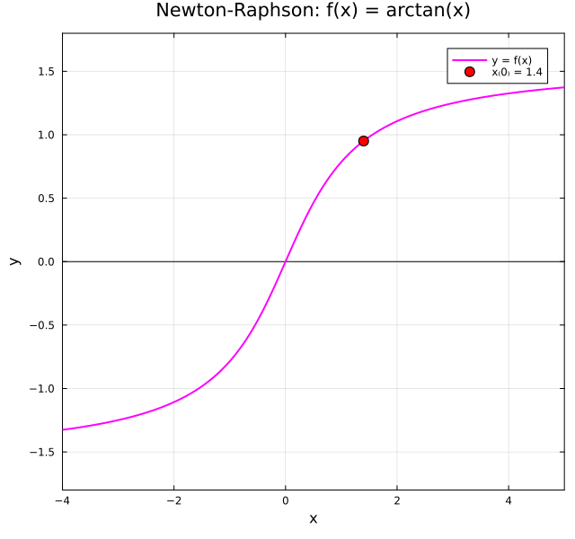

← [Numerical Methods](../)

Source inspiration:  [@mathewsSite].

## Animations

Each animation below shows the **tangent-line diagram** for the Newton-Raphson method.
At each iterate $x_n$, a tangent line to $f(x)$ is drawn; its x-intercept gives $x_{n+1} = x_n - \tfrac{f(x_n)}{f'(x_n)}$.
The sequence of tangent lines traces the convergence (or divergence) toward a root.

Julia source scripts that generated these animations are linked under each case.

### Case 1 — Quadratic convergence, $f(x) = 3e^x - 4\cos(x)$, $x_0 = 1.0$

**Behavior:** A single real root exists near $x^* \approx 0.2910$.
Starting at $x_0 = 1.0$, each tangent line rapidly overshoots then undershoots before converging — illustrating the quadratic convergence rate typical of Newton-Raphson near a simple root.

[Julia source](newtonaa.jl)

### Case 2 — Linear convergence (double root), $f(x) = (1-5x)^2$, $x_0 = 1.0$

**Behavior:** A double root at $x^* = 0.2$. Because $f'(x^*) = 0$, the standard convergence proof breaks down and Newton-Raphson degrades to linear convergence — each step roughly halves the error rather than squaring it.

[Julia source](newtonbb.jl)

### Case 3 — Convergent near inflection point, $f(x) = \arctan(x)$, $x_0 = 1.35$

**Behavior:** The only root is $x^* = 0$. For $f(x) = \arctan(x)$, Newton-Raphson converges only when $|x_0| < x_c \approx 1.3917$.
Starting at $x_0 = 1.35$ (just inside the convergence radius), the method converges but requires several oscillating steps before settling in.

[Julia source](newtoncc.jl)

### Case 4 — No real root (cycling / divergence), $f(x) = x^3 - x + 3$, $x_0 = 0.0$

**Behavior:** $f(x) = x^3 - x + 3$ has no real roots (its minimum value is above zero).
Starting at $x_0 = 0$, the tangent lines chase an intercept that does not exist, and the iterates cycle or diverge — a cautionary example showing Newton-Raphson can fail completely when no root exists.

[Julia source](newtondd.jl)

### Case 5 — Convergence with vanishing derivative, $f(x) = xe^{-x}$, $x_0 = 2.0$

**Behavior:** The only root is $x^* = 0$. For large $x$, $f'(x) = (1-x)e^{-x}$ is small and negative, so early tangent lines produce large jumps leftward.
Convergence is eventual but the steeply angled early tangent lines demonstrate the effect of a nearly-flat curve far from the root.

[Julia source](newtonee.jl)

### Case 6 — Divergent, $f(x) = \arctan(x)$, $x_0 = 1.4$

**Behavior:** Same function as Case 3 but starting at $x_0 = 1.4$ — just outside the critical convergence radius $x_c \approx 1.3917$.
The iterates do not converge to the root; they escape toward larger $|x|$, illustrating the sensitivity of Newton-Raphson to the choice of starting point for flat-tailed functions.

[Julia source](newtonff.jl)

