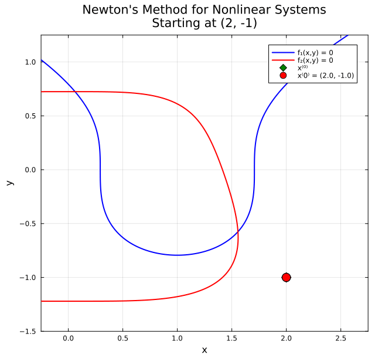

← [Numerical Methods](../)

Source inspiration: [@mathewsSite].

## Description

Many real-world problems require finding a point $(x, y)$ (or a vector $\mathbf{X}$ in higher dimensions) that simultaneously satisfies several nonlinear equations. The general problem is to solve the **nonlinear system**

$$\begin{cases} f(x, y) = 0 \\ g(x, y) = 0 \end{cases}$$

Geometrically, each equation defines a curve in the plane and the solutions are the **points of intersection** of those curves. Two standard iterative strategies extend the scalar root-finding ideas to systems: fixed-point iteration and Newton's method.

### The Jacobian Matrix

Both methods rely on the **Jacobian matrix**, which collects all first-order partial derivatives and describes how small changes in the inputs propagate to changes in the outputs. For a vector function $\mathbf{F}(x,y) = \bigl(f(x,y),\; g(x,y)\bigr)^T$ the Jacobian is

$$J(\mathbf{X}) = \begin{pmatrix} \dfrac{\partial f}{\partial x} & \dfrac{\partial f}{\partial y} \\[8pt] \dfrac{\partial g}{\partial x} & \dfrac{\partial g}{\partial y} \end{pmatrix}.$$

In $n$ dimensions the Jacobian is the $n \times n$ matrix $J_{ij} = \partial F_i / \partial x_j$.

### Fixed-Point Iteration for Systems

Rewrite the system in the form $\mathbf{X} = \mathbf{G}(\mathbf{X})$, i.e.

$$\begin{cases} x = g_1(x, y) \\ y = g_2(x, y) \end{cases}$$

and iterate $\mathbf{X}^{(k+1)} = \mathbf{G}\!\left(\mathbf{X}^{(k)}\right)$ starting from an initial guess $\mathbf{X}^{(0)}$.

**Convergence condition (2D).** If the fixed point $\mathbf{X}^*$ exists and the starting point is sufficiently close to it, the iteration converges provided the row-sum condition holds at $\mathbf{X}^*$:

$$\left|\frac{\partial g_1}{\partial x}\right| + \left|\frac{\partial g_1}{\partial y}\right| < 1 \qquad \text{and} \qquad \left|\frac{\partial g_2}{\partial x}\right| + \left|\frac{\partial g_2}{\partial y}\right| < 1.$$

When these inequalities are violated the iteration typically diverges, regardless of how close the starting point is.

### Newton's Method for Nonlinear Systems

Newton's method extends the scalar tangent-line idea by using the Jacobian to linearize $\mathbf{F}$ at the current iterate. Near a point $\mathbf{X}^{(k)}$ we approximate

$$\mathbf{F}\!\left(\mathbf{X}^{(k)} + \Delta\mathbf{X}\right) \approx \mathbf{F}\!\left(\mathbf{X}^{(k)}\right) + J\!\left(\mathbf{X}^{(k)}\right)\,\Delta\mathbf{X} = \mathbf{0}.$$

This linear system is solved for the **Newton step** $\Delta\mathbf{X}$ and the iterate is updated:

$$J\!\left(\mathbf{X}^{(k)}\right)\,\Delta\mathbf{X}^{(k)} = -\mathbf{F}\!\left(\mathbf{X}^{(k)}\right), \qquad \mathbf{X}^{(k+1)} = \mathbf{X}^{(k)} + \Delta\mathbf{X}^{(k)}.$$

The four steps of one Newton iteration are:

1. Evaluate $\mathbf{F}\!\left(\mathbf{X}^{(k)}\right)$.
2. Evaluate the Jacobian $J\!\left(\mathbf{X}^{(k)}\right)$.
3. Solve the linear system $J\,\Delta\mathbf{X} = -\mathbf{F}$ for $\Delta\mathbf{X}$.
4. Set $\mathbf{X}^{(k+1)} = \mathbf{X}^{(k)} + \Delta\mathbf{X}$.

Newton's method converges **quadratically** near a non-singular solution (one where $\det J(\mathbf{X}^*) \neq 0$), meaning the number of correct digits roughly doubles each iteration. If the Jacobian is singular at the solution, the quadratic rate is lost. Because the formulation is dimension-independent, exactly the same algorithm applies in 3D, 10D, or any higher dimension — only the size of the linear system in Step 3 changes.

### Comparison

| Property | Fixed-Point Iteration | Newton's Method |
|---|---|---|
| Convergence rate | Linear (when it converges) | Quadratic |
| Cost per iteration | Low (function evaluations only) | Higher (Jacobian + linear solve) |
| Convergence guarantee | Requires row-sum condition | Requires good starting guess |
| Starting-point sensitivity | High | Moderate |

Newton's method is generally preferred when high accuracy is needed and the Jacobian is cheap to form. Fixed-point iteration is simpler to implement but requires careful formulation of $\mathbf{G}$ to satisfy the convergence condition.

## Animations

Each animation below shows the **Newton iteration path in the $xy$-plane** for the system

$$\begin{cases} f_1(x,y) = 1 - 4x + 2x^2 - 2y^3 = 0 \\ f_2(x,y) = -4 + x^4 + 4y + 4y^4 = 0 \end{cases}$$

The blue curve is $f_1 = 0$ and the red curve is $f_2 = 0$. Their two intersections are the solutions. Each frame adds one Newton step: the Jacobian is evaluated at the current point, the linear system $J\,\Delta\mathbf{X} = -\mathbf{F}$ is solved, and the iterate moves to $\mathbf{X}^{(k+1)} = \mathbf{X}^{(k)} + \Delta\mathbf{X}^{(k)}$. Quadratic convergence means the error roughly squares each step — the path reaches the intersection within a handful of iterations from anywhere in the basin.

Julia source scripts that generated these animations are linked under each case.

### Case 1 — Solution 1, starting at $(0.5,\; 0.8)$

**Behavior:** Starting in the upper region between the two curves, Newton's method converges rapidly to Solution 1 at approximately $(x^*, y^*) \approx (0.0618,\; 0.7245)$, the intersection in the upper-left portion of the plot. The path reaches machine precision in a few steps, demonstrating $|g'(x^*)| \approx 0$ — quadratic convergence in 2D.

[Julia source](newtonsysaa.jl)

### Case 2 — Solution 2, starting at $(2,\; -1)$

**Behavior:** Starting in the lower-right region near Solution 2, Newton's method converges to $(x^*, y^*) \approx (1.5561,\; -0.5757)$, the intersection near the bottom of the curves. This solution has a large negative $y$ component and lies at the outer loop of the $f_2 = 0$ curve. Again convergence is quadratic: the first step brings the iterate close to the solution, and subsequent steps nail it to full precision.

[Julia source](newtonsysab.jl)

