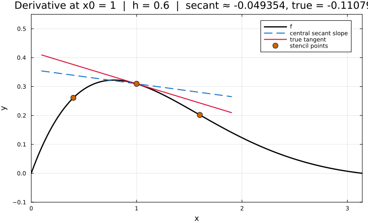

← [Numerical Methods](../)

Source inspiration: [@mathewsSite].

## Description

Numerical differentiation replaces analytic derivatives with finite-difference quotients built from nearby function values. In the Mathews examples for this module, the test function is $f(x)=e^{-x}\sin(x)$ on $[0,\pi]$ with representative steps $h=0.1,0.01,0.001$.

The three-point central approximation for the first derivative is

$$
f'(x) \approx D_3(x,h) = \frac{f(x+h)-f(x-h)}{2h},
$$

with truncation error $O(h^2)$ when $f$ is sufficiently smooth. As $h$ decreases, truncation error improves, but eventually roundoff and cancellation can limit accuracy.

## Animations

Each animation below shows finite-difference derivative behavior for $f(x)=e^{-x}\sin(x)$ on legacy interval settings from the source module.

### Case 1 - central derivative profile, $D_3(x,h)$ on $[0,\pi]$

**Behavior:** The numerical derivative curve approaches $f'(x)$ as $h$ shrinks, consistent with second-order truncation error for the central stencil.

[Julia source](numdiffaa.jl)

### Case 2 - secant to tangent at $x_0=1$, $h \to 0$

**Behavior:** The slope from the symmetric secant $(f(x_0+h)-f(x_0-h))/(2h)$ converges to the tangent slope $f'(x_0)$ as the stencil contracts.

[Julia source](numdiffab.jl)

## Derivation Notes

For smooth $f$, Taylor expansions about $x$ give

$$
f(x\pm h) = f(x) \pm h f'(x) + \frac{h^2}{2}f''(x) \pm \frac{h^3}{6}f^{(3)}(\xi_\pm),
$$

which leads to the central three-point first-derivative rule with error proportional to $h^2$.

