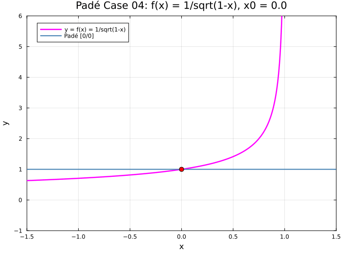
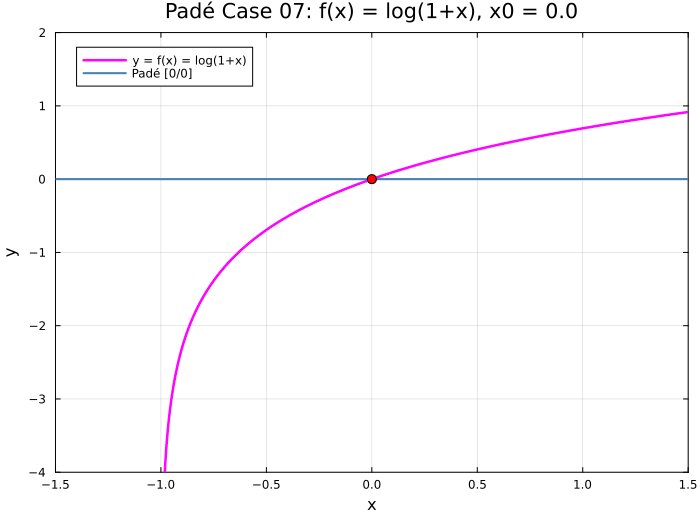
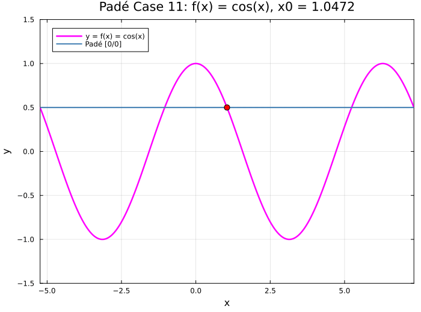

← [Numerical Methods](../)

Source inspiration: [@mathewsSite].

## Description

Padé approximant is a rationale function approximation expanded from a function value and the derivative function values similar to Taylor Series. Often, Padé approximant's can converge when Taylor Series does not even though both use the same information at a point. The key is Taylor Series is a polynomial while Padé approximant is a rationale function. Rationale functions can have singularities/vertical-asymptotes and horizontal asymptotes. Polynomials do not have asymptotes or singularities.

Padé approximation replaces a polynomial truncation with a ratio of two polynomials,

$$
R_{m,n}(x)=\frac{P_m(x)}{Q_n(x)},\qquad Q_n(x_0)=1,
$$

and chooses coefficients so the Taylor expansion of $R_{m,n}$ about $x_0$ matches the target function through order $m+n$. This really means derivatives match for give $m$ and $n$. 

Compared with a Taylor polynomial of the same total order, Padé approximants can represent poles and often stay accurate on larger intervals, especially for functions with nearby singularities or branch-point behavior.

High-order Padé Approximants can be hard to compute because of how fast the coefficients grow. Total orders (denominator plus numerator order) of less than 20 fail at times for MATLAB's symbolic `pade` function fails. `padeapprox` from chebfun also struggles. It takes a lot of effort to compute a high-order Padé approximate.

The most useful way to understand Padé approximant is to watch the animations below. For details on the construction, see the resources section below.

## Outside Links

[Wikipedia Padé approximate](https://en.wikipedia.org/wiki/Pad%C3%A9_approximant) - A good overview of Pade's approximate.

[Matlab Symbolic Pade Approximant Page](https://www.mathworks.com/help/releases/R2025b/symbolic/sym.pade.html)

[Chebfun](http://www.chebfun.org/) has a function called `padeapprox` that calculates a Padé approximant numerically. `padeapprox` is based on this paper, [Robust Padé Approximation via SVD](https://epubs.siam.org/doi/abs/10.1137/110853236).

## Video Animations

These videos have a different aesthetic than the GIFs. The videos are generated by a MATLAB script:

[pade_animation_code.m](pade_animation_code.m)

### $exp(x)$ about 0 and 1





### $tanh(x)$ about 0 and 0.5





### $arctan(x)$ about 0 and 0.5





### $1/x$ about 0.5



### $1/(x-1)$ about 0.75



### $sin(x)$ about 0 and 0.5





### $x/(x^2 + 0.01^2)^{1/4}$ about 0.5



### Runge function $1/(1+25x^2)$ about 0 and 0.5





## Animations

Each animation shows one Padé order per frame for a fixed center $x_0$, overlaid on the target function.

[Julia source for all cases](pade_animations_all.jl)

### Case 01 — $f(x)=\sqrt{x}$, $x_0=1$, $x\in[0,10.5]$

[Julia source](pade_animations_all.jl)

![Padé approximation frames for sqrt(x) centered at x0=1 over x in [0,10.5].](pade01.gif)

### Case 02 — $f(x)=\sqrt{x}$, $x_0=4$, $x\in[0,10.5]$

[Julia source](pade_animations_all.jl)

![Padé approximation frames for sqrt(x) centered at x0=4 over x in [0,10.5].](pade02.gif)

### Case 03 — $f(x)=\sqrt{x}$, $x_0=5$, $x\in[0,10.5]$

[Julia source](pade_animations_all.jl)

![Padé approximation frames for sqrt(x) centered at x0=5 over x in [0,10.5].](pade03.gif)

### Case 04 — $f(x)=\dfrac{1}{\sqrt{1-x}}$, $x_0=0$, $x\in[-1.5,1.5]$

[Julia source](pade_animations_all.jl)

### Case 05 — $f(x)=\log(x)$, $x_0=1$, $x\in[-0.5,4.1]$

[Julia source](pade_animations_all.jl)

![Padé approximation frames for log(x) centered at x0=1 over x in [-0.5,4.1].](pade05.gif)

### Case 06 — $f(x)=\log(x)$, $x_0=2$, $x\in[-0.5,4.1]$

[Julia source](pade_animations_all.jl)

![Padé approximation frames for log(x) centered at x0=2 over x in [-0.5,4.1].](pade06.gif)

### Case 07 — $f(x)=\log(1+x)$, $x_0=0$, $x\in[-1.5,1.5]$

[Julia source](pade_animations_all.jl)

### Case 08 — $f(x)=\sin(x)$, $x_0=0$, $x\in[-3\pi,3\pi]$

[Julia source](pade_animations_all.jl)

![Padé approximation frames for sin(x) centered at x0=0 over x in [-3pi,3pi].](pade08.gif)

### Case 09 — $f(x)=\cos(x)$, $x_0=0$, $x\in[-3\pi,3\pi]$

[Julia source](pade_animations_all.jl)

![Padé approximation frames for cos(x) centered at zero over x in [-3pi,3pi].](pade09.gif)

### Case 10 — $f(x)=\sin(x)$, $x_0=\pi/4$, $x\in[-7\pi/4,9\pi/4]$

[Julia source](pade_animations_all.jl)

### Case 11 — $f(x)=\cos(x)$, $x_0=\pi/3$, $x\in[-5\pi/3,7\pi/3]$

[Julia source](pade_animations_all.jl)

### Case 12 — $f(x)=\tan(x)$, $x_0=0$, $x\in[-\pi,\pi]$

[Julia source](pade_animations_all.jl)

![Padé approximation frames for tan(x) centered at x0=0 over x in [-pi,pi].](pade12.gif)

### Case 13 — $f(x)=e^x$, $x_0=0$, $x\in[-2,3]$

[Julia source](pade_animations_all.jl)

![Padé approximation frames for exp(x) centered at zero over x in [-2,3].](pade13.gif)

### Case 14 — $f(x)=e^{-x}\cos(x)$, $x_0=0$, $x\in[-2,4]$

[Julia source](pade_animations_all.jl)

![Padé approximation frames for exp(-x)cos(x) centered at zero over x in [-2,4].](pade14.gif)

### Case 15 — $f(x)=\cosh(x)$, $x_0=0$, $x\in[-4,4]$

[Julia source](pade_animations_all.jl)

![Padé approximation frames for cosh(x) centered at zero over x in [-4,4].](pade15.gif)

### Case 16 — $f(x)=\arctan(x)$, $x_0=0$, $x\in[-2,2]$

[Julia source](pade_animations_all.jl)

![Padé approximation frames for arctan(x) centered at zero over x in [-2,2].](pade16.gif)

### Case 17 — $f(x)=\arcsin(x)$, $x_0=0$, $x\in[-1.5,1.5]$

[Julia source](pade_animations_all.jl)

![Padé approximation frames for arcsin(x) centered at x0=0 over x in [-1.5,1.5].](pade17.gif)

### Case 18 — $f(x)=J_0(x)$, $x_0=0$, $x\in[-10.2,10.2]$

[Julia source](pade_animations_all.jl)

![Padé approximation frames for Bessel J0 centered at zero over x in [-10.2,10.2].](pade18.gif)

### Case 19 — $f(x)=J_1(x)$, $x_0=0$, $x\in[-10.2,10.2]$

[Julia source](pade_animations_all.jl)

![Padé approximation frames for Bessel J1 centered at zero over x in [-10.2,10.2].](pade19.gif)

### Case 20 — $f(x)=\dfrac{1}{\sqrt{2\pi}}e^{-x^2/2}$, $x_0=0$, $x\in[-3,3]$

[Julia source](pade_animations_all.jl)

![Padé approximation frames for the normal density centered at zero over x in [-3,3].](pade20.gif)

### Case 21 — $f(x)=\dfrac{1}{2}+\dfrac{1}{2}\operatorname{erf}\!\left(\dfrac{x}{\sqrt{2}}\right)$, $x_0=0$, $x\in[-3,3]$

[Julia source](pade_animations_all.jl)

![Padé approximation frames for the normal CDF centered at zero over x in [-3,3].](pade21.gif)

### Case 22 — $f(x)=\Gamma(x)$, $x_0=1$, $x\in[-0.2,5.2]$

[Julia source](pade_animations_all.jl)

![Padé approximation frames for Gamma(x) centered at one over x in [-0.2,5.2].](pade22.gif)

### Case 23 — $f(x)=\Gamma(x)$, $x_0=2$, $x\in[-0.2,5.2]$

[Julia source](pade_animations_all.jl)

![Padé approximation frames for Gamma(x) centered at two over x in [-0.2,5.2].](pade23.gif)

### Case 24 — $f(x)=\Gamma(x)$, $x_0=3$, $x\in[-0.2,5.2]$

[Julia source](pade_animations_all.jl)

![Padé approximation frames for Gamma(x) centered at three over x in [-0.2,5.2].](pade24.gif)

### Case 25 — $f(x)=Y_0(x)$, $x_0=10$, $x\in[0,22]$

[Julia source](pade_animations_all.jl)

![Padé approximation frames for Bessel Y0 centered at ten over x in [0,22].](pade25.gif)

### Case 26 — $f(x)=Y_0(x)$, $x_0=5$, $x\in[0,22]$

[Julia source](pade_animations_all.jl)

![Padé approximation frames for Bessel Y0 centered at five over x in [0,22].](pade26.gif)

### Case 27 — $f(x)=Y_0(x)$, $x_0=2$, $x\in[0,22]$

[Julia source](pade_animations_all.jl)

![Padé approximation frames for Bessel Y0 centered at two over x in [0,22].](pade27.gif)

