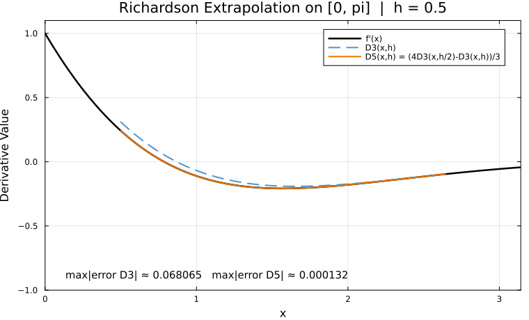
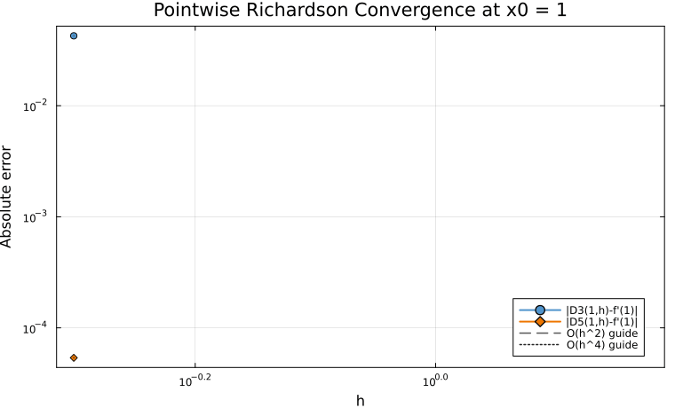

← [Numerical Methods](../)

Source inspiration: [@mathewsSite].

## Description

Richardson extrapolation combines two finite-difference estimates with different step sizes so that the leading truncation term cancels. In the legacy module, this is presented as a refinement of the central three-point derivative for $f(x)=e^{-x}\sin(x)$ over $[0,\pi]$.

Using

$$
D_3(x,h)=\frac{f(x+h)-f(x-h)}{2h},
$$

the Richardson-improved estimate is

$$
D_5(x,h)=\frac{4D_3(x,h/2)-D_3(x,h)}{3},
$$

which upgrades the local truncation behavior from $O(h^2)$ to $O(h^4)$ for smooth functions.

## Animations

Each animation below compares the base central difference with Richardson extrapolation for the legacy test function and interval.

### Case 1 - profile comparison, $D_3(x,h)$ vs. $D_5(x,h)$

**Behavior:** Both approximations converge as $h$ shrinks, but the Richardson curve tracks $f'(x)$ much more closely because the dominant $h^2$ error term is canceled.

[Julia source](richexaa.jl)

### Case 2 - pointwise convergence at $x_0=1$ on log-log axes

**Behavior:** The error slope for the three-point formula follows approximately $O(h^2)$, while Richardson extrapolation follows approximately $O(h^4)$ before roundoff effects appear.

[Julia source](richexab.jl)

## Derivation Notes

If $D_3(x,h)=f'(x)+C_2 h^2 + C_4 h^4 + \cdots$, then

$$
\frac{4D_3(x,h/2)-D_3(x,h)}{3}
= f'(x) + O(h^4),
$$

because the $C_2 h^2$ contribution cancels exactly.

