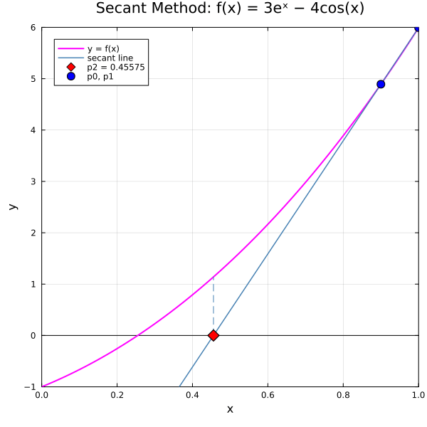
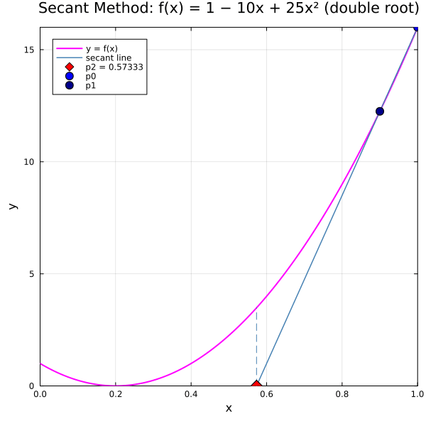
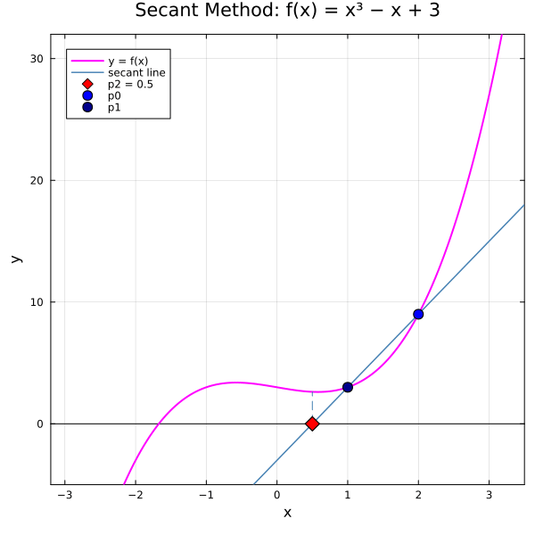
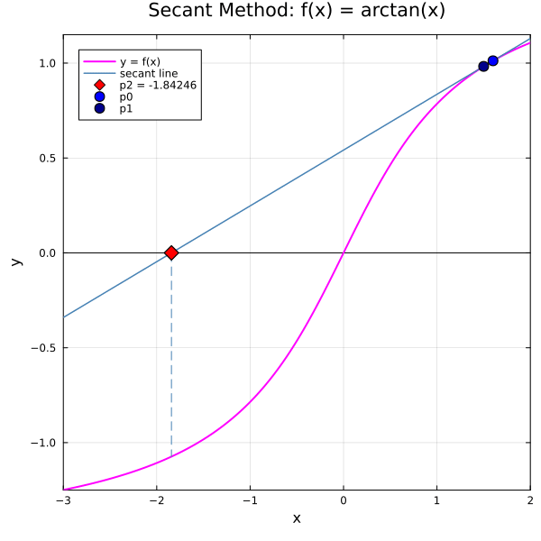

← [Numerical Methods](../)

Source inspiration: [@mathewsSite].

## Animations

Each animation below shows the **secant diagram** for the Secant Method. At each step, a secant line is drawn through the two most recent iterates $(p_{n-1}, f(p_{n-1}))$ and $(p_n, f(p_n))$; its x-intercept becomes $p_{n+1}$. Unlike Newton's method, no derivative is required — the slope is approximated from two function evaluations. The method can converge quickly, converge slowly near repeated roots, oscillate while converging, or diverge entirely depending on the function and starting points.

Julia source scripts that generated these animations are linked under each case.

### Case 1 — Fast Convergence, $f(x) = 3e^x - 4\cos(x)$, $p_0 = 1.0$, $p_1 = 0.9$

**Behavior:** The secant method converges quickly to the root near $x \approx 0.456$. Both starting points are on the same side of the root and the function is well-behaved, so the secant line immediately produces a good approximation.

[Julia source](secantmethodaa.jl)

### Case 2 — Slow Convergence (Double Root), $f(x) = 1 - 10x + 25x^2$, $p_0 = 1.0$, $p_1 = 0.9$

**Behavior:** The function $(1-5x)^2$ has a double root at $x = 0.2$ where $f'(0.2) = 0$. The secant method converges, but slowly — the double root causes the denominator $f(p_n) - f(p_{n-1})$ to shrink, giving small steps that creep toward the root over many iterations.

[Julia source](secantmethodbb.jl)

### Case 3 — Convergence with Oscillation, $f(x) = \arctan(x)$, $p_0 = 1.35$, $p_1 = 1.30$

**Behavior:** The secant method converges to the root at $x = 0$, but the iterates oscillate — jumping to the opposite side of the root each step before settling. The relatively flat slope of $\arctan$ near the starting points causes the secant line to overshoot to negative $x$ on the first step.

[Julia source](secantmethodcc.jl)

### Case 4 — Convergence (Oscillating Path to Distant Root), $f(x) = x^3 - x + 3$, $p_0 = 2.0$, $p_1 = 1.0$

**Behavior:** The cubic $x^3 - x + 3$ has a real root near $x \approx -1.672$. Starting from positive values far from the root, the secant iterates wander — including a large positive excursion — before eventually converging. This case illustrates that convergence can occur even when the path is non-monotone and the starting points are far from the root.

[Julia source](secantmethoddd.jl)

### Case 5 — NON Convergence (Diverging to Infinity), $f(x) = x e^{-x}$, $p_0 = 1.5$, $p_1 = 2.0$

**Behavior:** Although $f(x) = x e^{-x}$ has a root at $x = 0$, the secant method diverges with these starting points. The function decreases toward zero for large $x$, so the secant line through points on the decaying tail has a shallow negative slope whose x-intercept falls far to the right — each step pushes the estimate further from the root.

[Julia source](secantmethodee.jl)

### Case 6 — Convergence, $f(x) = \arctan(x)$, $p_0 = 1.60$, $p_1 = 1.50$

**Behavior:** With slightly larger starting values than Case 3, the method again converges to $x = 0$. Despite a larger first overshoot, subsequent steps quickly close in on the root, illustrating that the secant method converges super-linearly (order $\approx 1.618$) when the starting points are in the basin of convergence.

[Julia source](secantmethodff.jl)

