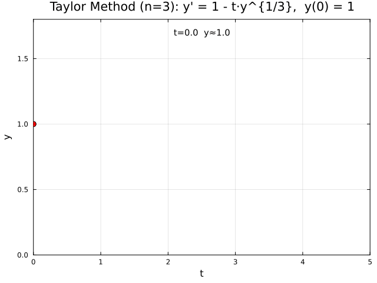

← [Numerical Methods](../)

Source inspiration: [@mathewsSite].

## Animations

Each animation below shows the **Taylor series solution trace** building step by step for the IVP $y' = 1 - t\sqrt[3]{y}$, $y(0)=1$ over $[0,5]$. Each frame adds one new solution point. The Taylor method uses the ODE to compute higher derivatives analytically, then advances via a truncated Taylor series $y_{n+1} = y_n + hy'_n + \frac{h^2}{2}y''_n + \cdots$ — giving local accuracy of $O(h^{p+1})$ for order $p$.

Julia source scripts that generated these animations are linked under each case.

### Case 1 — Taylor Order 3, $y' = 1 - t\sqrt[3]{y}$, $y(0)=1$

**Behavior:** With order $p=3$, three derivative terms are used per step. The local truncation error is $O(h^4)$, matching RK4 in order. The Taylor method requires explicit symbolic derivatives of the ODE right-hand side.

[Julia source](taylorderivativeaa.jl)

### Case 2 — Taylor Order 4, $y' = 1 - t\sqrt[3]{y}$, $y(0)=1$

**Behavior:** With order $p=4$, four derivative terms are used per step. The local truncation error is $O(h^5)$, giving slightly better accuracy than order 3 with the same step size $h=0.25$.

[Julia source](taylorderivativebb.jl)

## Derivation Notes (Planned)

Short derivations will be added to explain the core equations and assumptions.

## Worked Example (Planned)

A compact numerical example with intermediate steps will be included.

## Implementation Notes (Planned)

Implementation details, numerical stability notes, and practical pitfalls will be added.

## Legacy Animation Inventory (Stub)

- Legacy module page: [Taylor Series Method for ODE's](http://localhost:8000/n2003/TaylorDEMod.html) (ok)
- Animation links found in module Animations paragraph: 4
- Unique animation portals: 1

### Animation Portals

1. [Taylor Series Method for O.D.E.'s](http://localhost:8000/a2001/Animations/OrdinaryDE/Taylor/Taylor.html) (ok)

- Animation item links found: 2

### Animation Items

1. [Taylor's Method](http://localhost:8000/a2001/Animations/OrdinaryDE/Taylor1/Tayloraa.html) (ok)
- Main animated GIF count: 1
- http://localhost:8000/a2001/Animations/OrdinaryDE/Taylor1/Tayloraa.gif
2. [Taylor's Method](http://localhost:8000/a2001/Animations/OrdinaryDE/Taylor2/Taylorbb.html) (ok)
- Main animated GIF count: 1
- http://localhost:8000/a2001/Animations/OrdinaryDE/Taylor2/Taylorbb.gif

