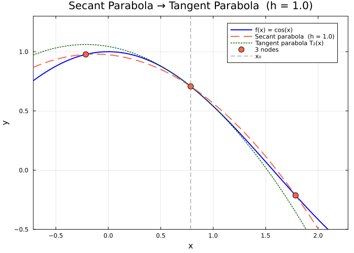

← [Numerical Methods](../)

Source inspiration: [@mathewsSite].

## Animations

The animation below shows the **secant parabola** (degree-2 Newton polynomial through $x_0 - h$, $x_0$, $x_0 + h$) converging to the **tangent parabola** (degree-2 Taylor polynomial at $x_0$) as $h \to 0$, for $f(x) = \cos(x)$ centered at $x_0 = \pi/4$.

Julia source scripts that generated these animations are linked under each case.

### Case 1 — Secant parabola $\to$ tangent parabola as $h \to 0$, $f(x) = \cos(x)$, $x_0 = \pi/4$

**Behavior:** For large $h$ the secant parabola is determined by three well-separated points. As $h \to 0$ all three nodes collapse to $x_0$, and the secant parabola approaches the Taylor polynomial $T_2(x) = f(x_0) + f'(x_0)(x-x_0) + \tfrac{1}{2}f''(x_0)(x-x_0)^2$ — the tangent parabola. This shows that the Taylor polynomial is the limiting position of the Newton interpolating parabola.

[Julia source](tangparabaa.jl)

## Derivation Notes (Planned)

Short derivations will be added to explain the core equations and assumptions.
