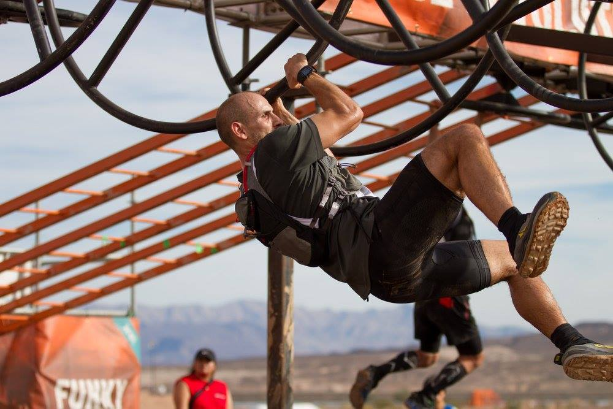
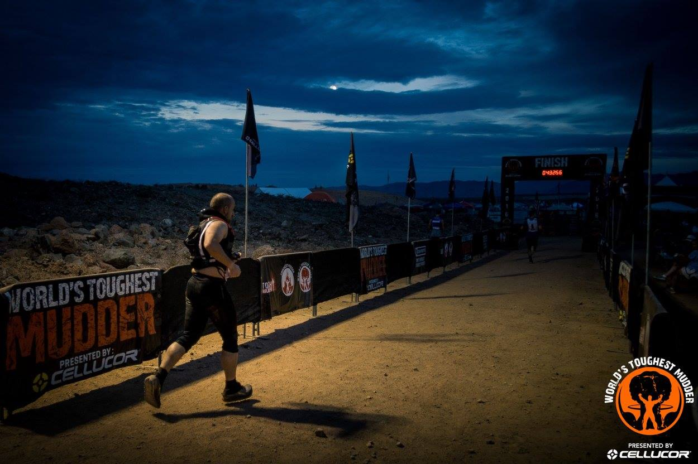
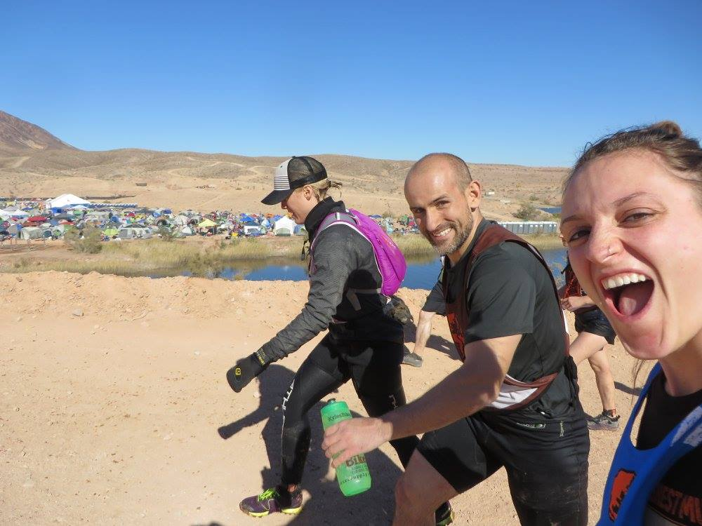
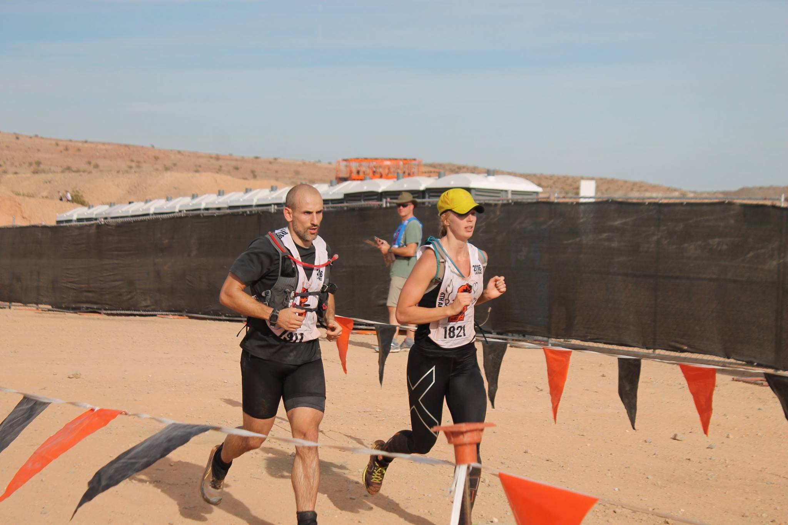
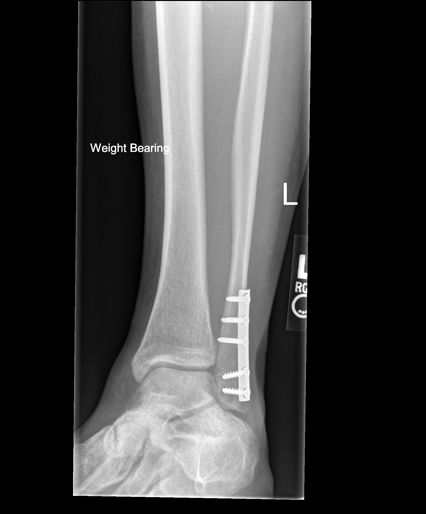

## The Summary

I feel proud, happy, accomplished, annoyed, and ashamed when I think about  2016. I’m proud to say that I completed thirteen laps/65 miles, finished the 24 hour race, and placed 95th overall out of 1,251 athletes. Considering all that went wrong, my performance was outstanding. But given everything that followed, and the costs that came along with that achievement, I have a seriously different perspective.

Two days after the race (Tuesday), I went to the Las Vegas emergency room in a lot of pain and just holding on to my ability to think by sheer will. The ER doctors admitted and placed me in the  with , rhabdomyolysis, and kidney failure, all related to decisions I had made during and after . My serum sodium levels was 117mEq/L which is a dangerously low value (normal is 135-145 mEq/L). My  test (a measure of muscle breakdown) was at 74,000 units/L which is 148 times the normal level of 500 units/L. The measures of my kidney function were appalling; BUN of 82mg/dL (normal 7 to 20 mg/dL), a creatinine level of 6.90mg/dL which went as high as 11 (normal is 0.6 - 1.2) and eGFR of 7, all indicated kidney failure. I spent four days in the  and seven total days in the hospital. It took four days to restore my sodium to acceptable levels. My kidneys were substantially damaged to require three rounds of dialysis to clean my blood.

All of this came about because of a cascade of ***three decisions*** at  that put me in the hospital. Knowing only what I did going into  2016, I would not do the same things twice. This is because knowing only what I did going into  2016 puts me in a place where I am flipping a coin on whether I end up in the hospital. That is gambling with my life. I don’t take chances where the odds are stacked against me in an unfair way with high wagers where I have only lady luck to count on. I am both ashamed and annoyed that I put myself in the hospital and couldn’t see it coming in the race. Having completed 40 miles in  2015 as a pacer/supporter I wanted to see what I could do. I felt that 80-85 miles was a reasonable goal. However, some of the conventional wisdom and normal habits in endurance racing are risky at best and life threatening at their worst.

---

\printacronyms

## Story

### Background

I came into  really well trained. I had a year of running ultra marathons, pacing/crewing ultra marathons, marathon training, focused grip and back work, weight training, and lots of general fitness type workouts. I felt strong, light, and fast. I was ready to crush  and put up some serious miles. I had put in 561 hours of exercise, including close to 2,000 miles, leading up to  2016 (see picture below). I wasn’t under trained and unprepared physically.

{fig-align="left"}

When  started, everything seemed fine. My heart rate was high but I knew why. It was the heat. I had my breathing under control. I knew since my breathing was under control and I didn’t feel stressed, that I was in a good place.

### Pictures from  2016

\
\

\
\

\
\

[Full Facebook Public Album Here](https://www.facebook.com/media/set/?set=a.10211203387741032&type=3){target="_blank"}

### Decision 1 - Overhydration and 

I was taking in about 1 liter of water with 400 calories of Tailwind per lap (~1:20:00). For those of you who are familiar with Tailwind, you know 400 calories is higher than suggested amount of 200 calories/hour. I made that decision because I have never had a stomach issues with Tailwind and my running efficiency isn’t very good. When I was metabolically tested, I burned 168 calories per mile at a weight of 175lbs. That is not a good efficiency. Good efficiency for me would be 120-140 calories per mile.

The decision to take in extra Tailwind and 1 liter of water was the initial decision that would later play a major role in the events that landed me in the hospital. Seems very benign, doesn’t it? I have since learned that endurance athletes should "**drink to thirst**"" lest they do exactly what I did, which is initiate .

In , the fluid surrounding the cell is diluted, so more water is pushed into cells to balance the concentrations inside and outside the cells. As the cells get overloaded, they swell. As a result, your whole body swells including, most noticeably, your hands and feet. Other early signs of  are nausea and vomiting, weakness, dizziness, and lethargy [@rosner2016hyponatremia]. Left uncorrected, or treated incorrectly,  can cause fluids build up in the lungs and brain cells to swell which can lead to seizure, coma and sometimes death. In fact, in his book ***Waterlogged***, Dr. Tim Noakes describes multiple deaths that occurred in  patients that were wrongly treated with copious IV fluids that were more dilute than blood (hypotonic normal saline: NS 0.9% AKA what absolutely everyone gets).

Additionally, I likely had a misfire of my .  is what kicks in during times of fluid lows and signals the body to release less fluid which helps maintain fluid volume. In theory, overdrinking should suppress  but in some people may encourage it. Meaning, the act of drinking too much water nudges the body to hold onto it [@miller2016rhabdo]. Peripheral swelling (third spacing) can actually stimulate secretion of  [@bruso2010rhabdo]. Use of NSAIDs during endurance events have also been implicated in  stimulation [@bennett2014practice].

### Decision 2 - Cramping, Muscle Damage and Rhabdomyolysis

After two laps into  (less than 2 hours in), I noticed that my legs were starting to slightly spasm. From past experience, I knew those spasm were the precursor to severe cramps. I switched over to water when I pitted before lap 3. I tried to flush my stomach out to prevent the severe cramping. At the time, I thought I was taking in too many calories and the blood was at my stomach instead of my legs; I don’t know if this was right or not but it is my reasoning to switch to straight water.

As I was coming into the Everest obstacle on Lap 3, I knew that if I took off quickly that I would cramp up and trip over myself so I immediately went for the penalty loop rather than risk a severe injury. The Everest penalty loop entailed a cold swim. Once I started swimming, my calves cramped up and my foot was locked out in the extended position (plantarflexion). The video below shows what severe calf cramps are like. I had to swim without the use of my legs. I kept myself calm and made it to the other side where I floated in the water resting in water just over my shoulders. I was waiting for the painful, locked out, balled up calves to release. I breathed deeply and maintained my composure even though the pain was excruciating. The lifeguard asked me if I was okay and I had to tell him, “yeah I am fine.” In other situations with the same level of cramping, I have screamed in pain. However,  was different, I was determined to recover so I could go on to finish the race. I just needed to stay calm and wait them out. This level of cramping though causes major muscle breakdown. From the cramping alone, I knew I would be sore the next day.



The cause of muscle cramping is not fully understood although there is a pattern of variables that tend to contribute to muscle cramps: heat, cold, and profound exertion are often cited. There are conflicting reports of the role of serum sodium levels on muscle cramps. Most notably, in Tim Noakes’s book ***Waterlogged: The Serious Problem of Overhydration in Endurance Sports*** [@noakes2012waterlogged], he demonstrates that neither low serum sodium nor dehydration have been proven in published studies to cause . While there is data to support the correlation, it originates at the Gatorade Sports Science Institute implying that the agenda of Gatorade Company is in play.

Later in lap 3 at Blockness obstacle, my quads locked up in the water for 5 minutes or so just like my calves did earlier in the lap. After the quad episode, I was able to stop the severe cramping from reoccurring. However, I had minor cramps the rest of the race, 21 hours, that occurred all over my body. The minor cramps transferred all over my body throughout the race including calves, quads, hamstrings, adductors, abs, lats, chest, biceps, triceps, and forearms. The most annoying was the upper abs near the rib cage. Those would cramp up every time I got out of Augustus Gloop. I would have to use my hand to massage the muscle to get them to release so I could run or walk. I was in a lot of pain after the cramping started and throughout the rest of race, but I wasn’t quitting. I was finishing. I had already determined this and prepared for this outcome long before the race ever started.

Rhabdomyolysis is characterized by muscle cramping and pain, weakness and dark urine (myoglobinuria). Laboratory studies of a patient with rhabdomyolysis reveal elevated serum muscle enzymes (including ). While a certain amount of  elevation is expected in endurance sports, my  upon admission was 148 times normal. Lastly, there is a correlation between muscle breakdown and  where an increased presence of muscle tissue in the blood can stimulate  which causes the body to hang on to fluid [@bruso2010rhabdo].

### Decision 3 - NSAIDs Role in Acute Kidney Injury in Endurance Events

The third major decision was what I did related to the  drug, ibuprofen (brand names include Motrin and Advil). I was in a lot of pain in my legs post cramping. I wanted to deal with the immense pain I was in while continuing the race. My legs hurt with each step. On a pain scale, it was a constant 7. At a pain level of 8, your face begins to wince and contort. I was just below an 8. Running down hill was excruciating to my calves. In the pit when my brother tried to massage my quad, I screamed in pain and told him to stop. To better understand my pain, let me explain. I have a high pain threshold. Once when I broke my ankle wrestling I hopped to the car and drove myself home (in a manual transmission) forty minutes and hopped up the stairs to my second level apartment; this happened in the evening. The next morning I took myself to the ER driving the same stick shift. At the ER, I was offered, and declined, pain medication for my broken ankle. I needed surgery. The surgeon placed five titanium screws and titanium plate in my ankle (see picture below). Even after surgery to place five screws and a metal plate I declined pain meds. The pain was the worst 1-2 days after surgery. Then I took pain meds once a day for two days and stopped. I am not against pain meds but I avoid them as much as I can stand.

Back to . The pack I was carrying had Ibuprofen readily available and was refilled by my pit crew each lap. In 12 hours, I had taken 15 (3,000 mg) of ibuprofen, which is not only double the recommended 12 hour amount (3,200 mg/24 hours) but the recommendation assumes fully functioning kidneys and a stable chemistry panel, neither of which I had.

The decision to use so much medication was impulsive because of the level of pain I was in. Please, don’t judge me too hard here. I know better than to do this. I have good discipline but the cloud of the pain and not thinking it through caused me to look for a way out. Once I calculated out the amount of Ibuprofen I had taken in, I quit taking it. Still, it was too late. Ibuprofen is cleared by the kidneys, whereas acetaminophen (Tylenol) is cleared by the liver. So the very organs that are taking the beating by being asked to clean up all the toxins and byproducts of this level of exercise are now asked to also process medication, and ibuprofen is a medication that restricts the blood flow to your kidneys. For these reasons my nephrologist (kidney doctor) convinced me that NSAIDs have no place in endurance events. Ever. A recent Stanford study demonstrated that use of ibuprofen during an endurance increased the chance of acute kidney injury by 50% when compared with placebo [@lipman2017ibuprofen]. In fact, my use of ibuprofen contributed directly to the development of life threatening  because of the way that it increases the activity of antidiuretic hormone () meaning, it causes the body to hold onto more water [@baker2005]. Inhibiting the release of excess fluid was the last thing I needed given all the fluid I was taking in.

Even with all that was going wrong and the pain I was in, I still kept going. I was physically moving well enough to pass the medical check and I was able to answer the questions at the neuro check. I was determined to finish. I finished the race with 65 miles. I was glad to be done. I was in pain but there was a relief of being done with the race.

Sunday afternoon and evening. I slept on and off. The first time I tried to urinate after the race, my urine was yellow with some light brown probably indicating some blood in the urine or the characteristic myoglobinuria of rhabdomyolysis. I knew that wasn’t good but I didn’t think of it as severe at the time. On subsequent trips to the bathroom I could neither urinate nor defecate. I told myself that this was just because I hadn’t eaten solid food for 24 hours. Then I started vomiting, had a bad headache and just felt lousy. I reasoned it away and tried to sleep it off. I felt like hell but I was done. What could possibly go wrong now? In its purest sense , is described as low serum sodium any time within 24 hours of completion of an event. So even when it was over, I was not out of trouble. In fact the reverse was true, I was only getting sicker. That’s also why, at the completion of the event you don’t just pound the water.

On Monday, I wanted to be at the  award ceremony for my friend Morgan McKay. Morgan had gotten 3rd among the women; I am proud of her. My legs were swollen and sore. They were the sorest they have ever been. It was difficult to even walk. At the Tough Mudder Banquet, when people were doing standing ovations, I did not stand. That was too much work to get up and down.

Monday afternoon is when I knew I needed to go to the hospital, but was talked out of it by my sister. My patience level was high and I respected what my sister had to say. For the remainder of Monday, I tried various foods and drinks but my body would still not urinate or defecate. Tuesday morning we were supposed to drive back to Iowa. We loaded up the car. I still felt terrible. My sister was driving. I texted Morgan. She said something that I don’t remember but then I decided I needed to go to the Emergency Room. My sister drove me there.

The ER doctors admitted and placed me in the  with , rhabdomyolysis, and kidney failure. My serum sodium levels was 117mEq/L which is a dangerously low value (normal is 135-145 mEq/L). My creatine kinase test (a measure of muscle breakdown) was at 74,000 units/L which is 148 times the normal level of 500 units/L. The measures of my kidney function were appalling; BUN of 82mg/dL (normal 7 to 20 mg/dL), a creatinine level of 6.90mg/dL which went as high as 11 (normal is 0.6 - 1.2) and eGFR of 7, all indicated kidney failure. I spent four days in the . It took four days to restore my sodium to acceptable levels.

My kidneys were substantially damaged. They required three rounds of dialysis to clean my blood. Dialysis is when your kidneys can’t remove the toxins from your blood. Your blood is piped out of you to a machine at the bedside, cleaned out there and sent back in. On the second round the technician had a lot of trouble with the machine. Some of it was caused my low heart rate. I fell asleep and my heart rate would drop into the upper 30s. When I was awake my heart rate was in the 40s. The technician wasn’t able to return all of my blood to me. Blood loss and the very act of removing my blood and tumbling it through a machine can burst red blood cells. In my opinion, this caused my anemia that lasted the next four months. The doctors were checking my blood panel every four hours and I had access to these numbers. I can see a clear time when my hemoglobin and hematocrit decreased outside normal levels.

In all, I spent 7 days in the hospital. Since my hospital episode, my kidneys have recovered. My sodium is back to normal but I am not totally recovered. My muscles and cardiovascular capacity are not what they were at the time of  or even similar levels leading up to . I have not returned to normal; the strength and endurance piece isn’t there. It is not that I haven’t trained or gone after getting back to what I was. I qualified as a contender at Toughest LA and Europe. I am registered for  2017. I am frustrated by my limitations. However, I have to accept this. I have to find a new normal.

Many of you who have done World’s Toughest Mudder have had  without knowing it. It is likely though that you did not have it as bad as I did or you were lucky. The incidence of  seems to be increased with duration of event making it especially relevant for events like  or Spartan’s Ultra Beast.  affected 51% of runners in a hundred mile footrace [@rosner2016hyponatremia]. I did meet a friend who describes some of my same symptoms I had but never went to the hospital. His kidneys did recover and he is still running . I remember thinking that putting me in the  was a bit excessive as I did not feel the kind of sick you would expect from an  patient. It wasn’t until I read *Waterlogged* about the people who actually died from this that I understood how sick I actually was. Since then I have educated myself and am committed to educating others. May you learn from my mistakes.

## General recommendations and Lessons

- **Drink to thirst**. There is no set volume/hour that you need to be ingesting. This includes after the event. Your body has a great many built in features to defend itself and can tolerate some body weight loss through fluids.

- **Drinking to thirst improves performance.** [@goulet2011] found that drinking to thirst significantly improves time trial (TT) in 98% of cases when compared to the rate of drinking below thirst and in 62% of cases when compared to drinking beyond the thirst threshold [@noakes2012waterlogged, p. 103].

- **Salt works great on acute cramps.** Things like mustard, salt packs, and pickle juice can break a cramp because of Schwellnus’ neuromuscular theory of cramps [@noakes2012waterlogged]. The idea here is that it is the salt that triggers an instantaneous neurological response that causes the cramp to release. The response time is too short for the salt intake to have affected the serum sodium level in the blood.

- **Go easy on the salt tabs**, you CAN have too much of a good thing. Taking in supplemental salt has not been proved to prevent the onset of  in the face of overdrinking. Overconsumption of salt drives up the fluid volume and therefore blood pressure. Higher fluid volume and pressure create a higher cardiac workload. You can end up with swollen hands/feet from taking in too much salt. You cannot outthink what your body needs, you can’t perfectly pre-plan it or calculate it. You just have to pay attention.

- Listen to your body and when it asks for salt take it in deliberately in the form of a favorite food; bacon, potato chips, pizza, and cup-o-noodles are all great sources of supplemental sodium.

- **Ibuprofen/NSAIDs have no place in endurance events**. It puts an extra load on your kidneys by restricting the blood to your kidneys. Your kidneys are already under extreme load. Don’t make it worse.

- **Recognize that  is common in endurance events to some degree.** Early signs include swelling of hands and feet, headache, nausea/vomiting, change in personality. Later signs are debilitating headache, coma, seizures, and death.

## What to do if faced with 

- Be your own advocate (or advocate for others). Know the signs and symptoms of common endurance ailments (see attached table) and watch for them in yourself and others. Hands too swollen to grip the rings on Kong? Consider mild . The treatment for mild  (if the patient can safely take in fluids) is oral ingestion of hypertonic (very salty) liquids such as very strong bouillon.

- At an endurance event don’t allow anyone to start an IV on you unless they have run your chemistry panel. This is easily accomplished in the TM med tent with a few drops of blood and 120 seconds in an i-STAT machine. If your chemistry panel cannot be run, know that many people--including event personnel and medical providers--will assume the cause is dehydration. The treatment for dehydration; a large volume of NaCl 0.9%, is a death sentence in .

- If the matter has progressed to  the treatment is 100 ml bolus of hypertonic saline administered via IV every ten minutes for up to three doses. This is the written (and appropriate) medical treatment protocol per Tough Mudder’s contractor for medical services Med Prep Group and verified by their medical director. For providers: *“It is possible to commence and indeed even complete treatment for  in the field” Wilderness Medical Society*

- If the matter has progressed to  the treatment is 100 ml bolus of hypertonic saline administered via IV every ten minutes for up to three doses. This is the written (and appropriate) medical treatment protocol per Tough Mudder’s contractor for medical services Med Prep Group and verified by their medical director. For providers: *“It is possible to commence and indeed even complete treatment for  in the field” Wilderness Medical Society*

***TABLE 1: Symptoms if Conditions Associated with Collapse in Endurance Athletes. (Noakes, page 348). Used with permission.***

| Condition | Symptoms |
| --- | --- |
| Exercise associated hyponatremia encephalopathy () | 1. Impaired exercise performance 2. Bloating and swollen face, hands, legs, and feet 3. Nausea and vomiting 4. Headache 5. Altered level of consciousness 6. Seizure (convulsion) 7. Coma, death |
| Dehydration | 1. Thirst 2. Impaired exercise performance, but only when thirst is present |
|  *This is the ultra runner that crosses the finish line and collapses but once flat recovers quickly.* | 1. Dizziness and faintness 2. Nausea is caused by reduced blood flow to the brain (cerebral ischemia) secondary to reduced blood pressure (hypotension) 3. Vomiting (occasionally), which is also due to cerebral edema |
| Heatstroke | 1. Impaired exercise performance 2. Altered level of consciousness: confusion, loss of control, aggression 3. Collapse 4. Coma |

