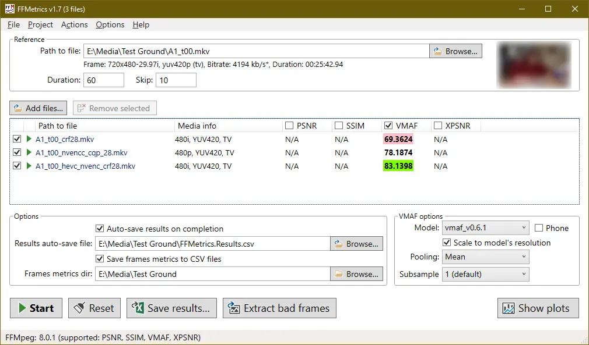

VMAF (Video Multi-Method Assessment Fusion) is a perceptual video quality metric developed by Netflix that combines multiple quality metrics to provide a single score that correlates well with human perception of video quality. [FFMetrics] is a FFMpeg GUI that can calculate the VMAF metric. VMAF is useful for finding a quality level when compress videos. It is more accurate than traditional metrics like PSNR and SSIM, which often do not correlate well with perceived video quality. VMAF takes into account various factors such as spatial and temporal information, color fidelity, and other perceptual features to provide a more comprehensive assessment of video quality. By using VMAF, you can optimize your video encoding settings to achieve the best possible quality at a given bitrate. A score of 100 means the encoded video is indistinguishable from the original, while lower scores indicate a greater loss in quality. Generally, a VMAF score above 90 is considered good quality, while scores below 80 may indicate noticeable degradation. [FFMetrics] can output VMAF per frame so you can find the worst encoded parts of the video and analyze them.

The process involves a starting video and then several encodings of the video at different quality levels. The VMAF score is calculated for each encoded video against the original video, allowing you to see how the quality changes with different encoding settings. You can use this to correlate VMAF score with what you subjective think is good quality. Below is an example of the FFMetrics GUI output:

[FFMetrics]: (https://github.com/fifonik/FFMetrics)