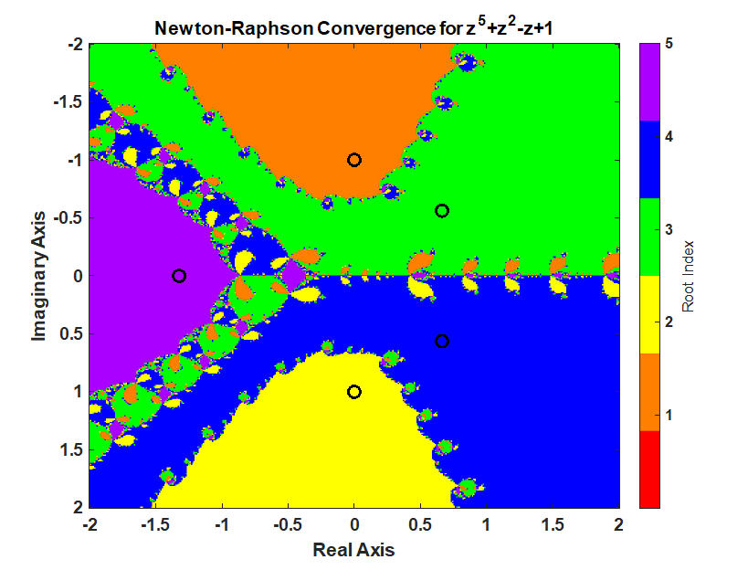
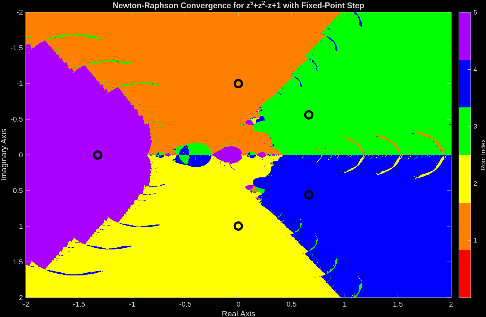

## Introduction

In [Trust-Region-Dogleg and Newton-Raphson - A Quick Comparison on a 5th order polynomial](../../2021/10/2021-10-24-trust-region-dogleg-and-newton-raphson-a-quick-story.qmd), we saw how the Newton-Raphson method produces a fractal pattern in the complex plane when finding roots of a polynomial. The fractal patterns show how Newton is unstable near the boundary of the basins of attraction for the roots. In this post, we will look at taking a step that is stable at every step according to the fixed point theorem. I am anticipating that this will produce a much smoother pattern in the complex plane. 

## polynomial setup

Given the polynomial

$$P(z) = z^5 + z^2 - z + 1 = 0$$

find a root starting from anywhere in the interval of -2 to 2 and -2i to 2i.

## Newton-Raphson Iteration

Using Newton's method starting anywhere in the interval -2 to 2 and -2i to 2i produces the following pattern.

```matlab
 clc;clear; close all;
% setup polynomial function
coefficients = [1 0 0 1 -1 1];
polynomialFunction = @(z) polyval(coefficients, z);

% setup the derivative of the polynomial function
coefficients_dot = polyder(coefficients);
polynomialDerivativeFunction = @(z) polyval(coefficients_dot, z);

% roots of the polynomial. roots uses a eigenvalues of a companion matrix approach.
% rootsOfPolynomial = roots(coefficients);

% exact roots
rootsOfPolynomial(1) = -1i;
rootsOfPolynomial(2) =  1i;
rootsOfPolynomial(3) =  (2^(2/3)*(3^(1/3) - 3^(5/6)*1i)*(69^(1/2) + 9)^(1/3))/12 + (2^(2/3)*3^(1/3)*(9 - 69^(1/2))^(1/3))/12 + (2^(2/3)*3^(5/6)*(9 - 69^(1/2))^(1/3)*1i)/12;
rootsOfPolynomial(4) =  (2^(2/3)*(3^(1/3) + 3^(5/6)*1i)*(69^(1/2) + 9)^(1/3))/12 + (2^(2/3)*3^(1/3)*(9 - 69^(1/2))^(1/3))/12 - (2^(2/3)*3^(5/6)*(9 - 69^(1/2))^(1/3)*1i)/12;
rootsOfPolynomial(5) = -(2^(2/3)*3^(1/3)*((69^(1/2) + 9)^(1/3) + (9 - 69^(1/2))^(1/3)))/6;

% Calculate a grid of starting points using the ndgrid format. x (real part)
% follow rows (1st dimension) and y follows the columns (2nd dimension).
% ndgrid is format is transpose of meshgrid format. meshgrid format is used
% for plotting surfaces.
nStartingPointReal = 400;
nStartingPointImaginary = 401;
startingPointReal = linspace(-2,2,nStartingPointReal)';
startingPointImaginary = linspace(-2,2+eps(2),nStartingPointImaginary)*1i;
startingPoint = startingPointReal + startingPointImaginary; % using singleton expansion

maxIterations = 100;
functionTolerance = 1e-14;
divideByZeroTolerance = 1000; % 1000*eps(p)

% setup for iteration
isConverged = false(nStartingPointReal, nStartingPointImaginary);
isDivideByZero = false(nStartingPointReal, nStartingPointImaginary);

whileFlag = true;
iteration = 0;
z = startingPoint;

% check if the starting value was already converged.
% polynomial is less then functionTolerance.
p = polynomialFunction(z(~isConverged));
isConverged(~isConverged) = abs(p) < functionTolerance;

% begin iteration
p = polynomialFunction(z(~isConverged));
while whileFlag
    % increment iteration number
    iteration = iteration + 1;
    
    p = polynomialFunction(z(~isConverged));
    
    % Calculate the derivative of the polynomial.
    % Check for divide by 0. If p_dot is close to machine precision
    % of p, then its a divide by 0 error. 
    % Stop all further iteration.
    p_dot = polynomialDerivativeFunction(z(~isConverged));
    isDivideByZeroIteration = abs(p_dot) < divideByZeroTolerance*eps(abs(p));
    isDivideByZero(~isConverged) = isDivideByZeroIteration;
    isConverged(~isConverged) = isDivideByZeroIteration;
    
    % calculate Newton iteration on unconverged points.
    z(~isConverged) = z(~isConverged) - p(~isDivideByZeroIteration)./p_dot(~isDivideByZeroIteration);
    
    % check for convergence
    p = polynomialFunction(z(~isConverged));
    isConverged(~isConverged) = abs(p) < functionTolerance;
    
    % set while flag
    % all roots have converged or reached max iterations
    whileFlag = iteration <= maxIterations || all(all(~isConverged));
end

% successful roots
isRoot = isConverged & ~isDivideByZero;

% which root did newton's method converge too?
% calculate the difference between the converged root and the roots of the polynomial
% the smallest distance corresponds to the root index
zDiff = abs(z - reshape(rootsOfPolynomial,1,1,[])); % using singelton expansion
[rootErrors,rootIndex] = min(zDiff,[],3); % minimum along 3rd dimension
rootIndex(~isRoot) = 0;

% create the fractal image
% imagesc uses the meshgrid format where 
% x is the 2nd dimension 
% y is the first dimension
% therefore, transpose rootIndex because its in the ndgrid format
figure;
imagesc(startingPointReal', imag(startingPointImaginary), rootIndex')
c = prism(numel(rootsOfPolynomial)+1);
colormap(c);
xlabel("Real Axis"); ylabel("Imaginary Axis")
ylabel(colorbar('Ticks',1:numel(rootsOfPolynomial)),"Root Index")
hold all;
plot(rootsOfPolynomial,'ko','MarkerSize',10,'LineWidth',3)
title("Newton-Raphson Convergence for z^5+z^2-z+1")

```



## Newton-Raphson Iteration with step sized derived from the fixed point theorem

A fixed point is 

$$x_{k+1} = g(x_k)$$

In the context of Newton's method, a natural fixed-point map is

$$g(z_k) = z_k - \alpha \frac{P(z_k)}{P'(z_k)}$$

where $\alpha$ is a step size. The fixed-point convergence condition is

$$|g'(z_k)| < 1.$$

Differentiating $g$ gives

$$
g'(z_k)
= 1 - \alpha \left(\frac{P'(z_k)^2 - P(z_k)P''(z_k)}{P'(z_k)^2}\right).
$$

Define

$$
q_k = \frac{P'(z_k)^2 - P(z_k)P''(z_k)}{P'(z_k)^2},
$$

so that

$$g'(z_k) = 1 - \alpha q_k.$$

The stability condition becomes

$$|1 - \alpha q_k| < 1.$$

For real $q_k$, this is equivalent to $0 < \alpha q_k < 2$. In other words, if a standard Newton step would violate the fixed-point condition, we shrink or flip the size of the step so that $g'$ stays inside the interval $(-1,1)$.

Algorithmically, the code uses the following sign-aware rule:

1. Compute $q_k$ from the formula above.
2. If $|1 - q_k| < 1$, use $\alpha = 1$ (the usual Newton step).
3. If $q_k > 0$, set $\alpha = \frac{2}{q_k}$ so that $g'(z_k) = -1$ at the boundary.
4. If $q_k < 0$, set $\alpha = \frac{1}{q_k}$ so that $g'(z_k) = 0$ and the update stays within the stable region.

This is the same logic used in the MATLAB implementation: the step is left alone when it is already stable, and otherwise a sign-aware $\alpha$ is chosen so the fixed-point derivative remains inside $(-1,1)$.

```matlab
 clc;clear; close all;
% setup polynomial function
coefficients = [1 0 0 1 -1 1];
polynomialFunction = @(z) polyval(coefficients, z);

% setup the derivative of the polynomial function
coefficients_dot = polyder(coefficients);
coefficients_ddot = polyder(coefficients_dot);
polynomialDerivativeFunction = @(z) polyval(coefficients_dot, z);
polynomialSecondDerivativeFunction = @(z) polyval(coefficients_ddot, z);

% roots of the polynomial. roots uses a eigenvalues of a companion matrix approach.
% rootsOfPolynomial = roots(coefficients);

% exact roots
rootsOfPolynomial(1) = -1i;
rootsOfPolynomial(2) =  1i;
rootsOfPolynomial(3) =  (2^(2/3)*(3^(1/3) - 3^(5/6)*1i)*(69^(1/2) + 9)^(1/3))/12 + (2^(2/3)*3^(1/3)*(9 - 69^(1/2))^(1/3))/12 + (2^(2/3)*3^(5/6)*(9 - 69^(1/2))^(1/3)*1i)/12;
rootsOfPolynomial(4) =  (2^(2/3)*(3^(1/3) + 3^(5/6)*1i)*(69^(1/2) + 9)^(1/3))/12 + (2^(2/3)*3^(1/3)*(9 - 69^(1/2))^(1/3))/12 - (2^(2/3)*3^(5/6)*(9 - 69^(1/2))^(1/3)*1i)/12;
rootsOfPolynomial(5) = -(2^(2/3)*3^(1/3)*((69^(1/2) + 9)^(1/3) + (9 - 69^(1/2))^(1/3)))/6;

% Calculate a grid of starting points using the ndgrid format. x (real part)
% follow rows (1st dimension) and y follows the columns (2nd dimension).
% ndgrid is format is transpose of meshgrid format. meshgrid format is used
% for plotting surfaces.
nStartingPointReal = 1200;
nStartingPointImaginary = 1201;
startingPointReal = linspace(-2,2,nStartingPointReal)';
startingPointImaginary = linspace(-2,2+eps(2),nStartingPointImaginary)*1i;
startingPoint = startingPointReal + startingPointImaginary; % using singleton expansion

maxIterations = 100;
functionTolerance = 1e-14;
divideByZeroTolerance = 1000; % 1000*eps(p)

% setup for iteration
isConverged = false(nStartingPointReal, nStartingPointImaginary);
isDivideByZero = false(nStartingPointReal, nStartingPointImaginary);

whileFlag = true;
iteration = 0;
z = startingPoint;

% check if the starting value was already converged.
% polynomial is less then functionTolerance.
p = polynomialFunction(z(~isConverged));
isConverged(~isConverged) = abs(p) < functionTolerance;

% begin iteration
p = polynomialFunction(z(~isConverged));
while whileFlag
    % increment iteration number
    iteration = iteration + 1;
    
    p = polynomialFunction(z(~isConverged));
    
    % Calculate the derivative of the polynomial.
    % Check for divide by 0. If p_dot is close to machine precision
    % of p, then its a divide by 0 error. 
    % Stop all further iteration.
    p_dot = polynomialDerivativeFunction(z(~isConverged));
    isDivideByZeroIteration = abs(p_dot) < divideByZeroTolerance*eps(abs(p));
    isDivideByZero(~isConverged) = isDivideByZeroIteration;
    isConverged(~isConverged) = isDivideByZeroIteration;

    % Calculate step size to take.
    % For g(z) = z - alpha * P(z) / P'(z), the derivative is
    % g'(z) = 1 - alpha * (P'^2 - P*P'') / P'^2.
    % Let q = (P'^2 - P*P'') / P'^2, so g' = 1 - alpha*q.
    % For real q, the fixed-point condition |g'| < 1 is enforced by
    % leaving alpha = 1 alone when the Newton step is already stable.
    % When q > 0 we choose alpha = 2/q to place g' at the boundary,
    % and when q < 0 we choose alpha = 1/q to keep g' near zero.
    alpha = ones(size(p)); % initialize alpha
    p_ddot = polynomialSecondDerivativeFunction(z(~isConverged));
    pq = (p_dot.^2 - p.*p_ddot)./p_dot.^2;
    g_prime = 1 - pq;
    useStandardStep = abs(g_prime) < 1;
    pq_negative = pq < 0;
    alpha(~useStandardStep & pq_negative) = 1./pq(~useStandardStep & pq_negative);
    alpha(~useStandardStep & ~pq_negative) = 2./pq(~useStandardStep & ~pq_negative);

    % calculate Newton iteration on unconverged points.
    z(~isConverged) = z(~isConverged) -alpha(~isDivideByZeroIteration).*p(~isDivideByZeroIteration)./p_dot(~isDivideByZeroIteration);
    
    % check for convergence
    p = polynomialFunction(z(~isConverged));
    isConverged(~isConverged) = abs(p) < functionTolerance;
    
    % set while flag
    % all roots have converged or reached max iterations
    whileFlag = iteration <= maxIterations || all(all(~isConverged));
end

% successful roots
isRoot = isConverged & ~isDivideByZero;

% which root did newton's method converge too?
% calculate the difference between the converged root and the roots of the polynomial
% the smallest distance corresponds to the root index
zDiff = abs(z - reshape(rootsOfPolynomial,1,1,[])); % using singelton expansion
[rootErrors,rootIndex] = min(zDiff,[],3); % minimum along 3rd dimension
rootIndex(~isRoot) = 0;

% create the fractal image
% imagesc uses the meshgrid format where 
% x is the 2nd dimension 
% y is the first dimension
% therefore, transpose rootIndex because its in the ndgrid format
figure;
imagesc(startingPointReal', imag(startingPointImaginary), rootIndex')
c = prism(numel(rootsOfPolynomial)+1);
colormap(c);
xlabel("Real Axis"); ylabel("Imaginary Axis")
ylabel(colorbar('Ticks',1:numel(rootsOfPolynomial)),"Root Index")
hold on;
plot(rootsOfPolynomial,'ko','MarkerSize',10,'LineWidth',3)
title("Newton-Raphson Convergence for z^5+z^2-z+1 with Fixed-Point Step")
```



The boundaries of the basin of attraction are smoother than the standard Newton-Raphson method. However, I was hoping for smoother boundaries.